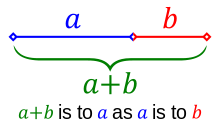
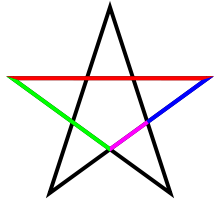
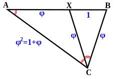
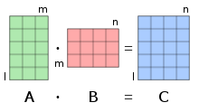

### _Fibonacci sequence_

The repository is about shooting large occurences of the **Fibonacci numbers** ([A000045](https://oeis.org/A000045)). The sequence is often a good pretext for exciting journeys to the heart of computer science and a means for illustrating programming patterns. Recall that the sequence $F_{n}$ is defined by the **recurrence relation**:

$$ F_{0}=0, \quad F_{1}=1, \quad n\in \mathbb{N}^{+}, n\gt 1 \to F_{n} = F_{n-1} + F_{n-2} $$

[Fibonacci sequence wikipedia](https://en.wikipedia.org/wiki/Fibonacci_sequence)

<details>
<summary>Negative generalization</summary>

Using $F_{n-2} = F_{n} - F_{n-1}$, one can extend the sequence to the relative integers set $\mathbb{Z}$:

$$F_{-n} = \big( -1\big) ^{n+1} \times F_{n}$$

$\quad {\color{red}\dots}, {\color{green}28657}, {\color{red}-17711}, {\color{green}10946}, {\color{red}-6765}, {\color{green}4181}, {\color{red}-2584}, {\color{green}1597}, {\color{red}-987}, {\color{green}610}, {\color{red}-377}, {\color{green}233}, {\color{red}-144}, {\color{green}89}, {\color{red}-55}, {\color{green}34}, {\color{red}-21}, {\color{green}13}, {\color{red}-8}, {\color{green}5}, {\color{red}-3}, {\color{green}2}, {\color{red}-1},$ <br/>
$\quad \quad 0, {\color{green}1,1,2,3,5,8,13,21,34,55,89,144,233,610,987,1597,2584,4181,6765,10946,\dots,354224848179261915075_{100},\dots}$

</details>

<details>
<summary>Machine code</summary>

Example of a function in hexadecimal representation of `x86-64` [machine code](https://en.wikipedia.org/wiki/Low-level_programming_language) to calculate the $n^{th}$ Fibonacci number, with each line corresponding to one instruction:

```javascript
89 f8
85 ff
74 26
83 ff 02
76 1c
89 f9
ba 01 00 00 00
be 01 00 00 00
8d 04 16
83 f9 02
74 0d
89 d6
ff c9
89 c2
eb f0
b8 01 00 00
c3
```
</details>

<details>
<summary>Assembly code</summary>

Example of the same Fibonacci number calculator, but in `x86-64` assembly language using `AT&T` syntax:

```assembly_x86
fib:
        movl %edi, %eax        ; put the argument into %eax
        testl %edi, %edi       ; is it zero?
        je .return_from_fib    ; yes - return 0, which is already in %eax
        cmpl $2, %edi          ; is 2 greater than or equal to it?
        jbe .return_1_from_fib ; yes (i.e., it's 1 or 2) - return 1
        movl %edi, %ecx        ; no - put it in %ecx, for use as a counter
        movl $1, %edx          ; the previous number in the sequence, which starts out as 1
        movl $1, %esi          ; the number before that, which also starts out as 1
.fib_loop:
        leal (%rsi,%rdx), %eax ; put the sum of the previous two numbers into %eax
        cmpl $2, %ecx          ; is the counter 2?
        je .return_from_fib    ; yes - %eax contains the result
        movl %edx, %esi        ; make the previous number the number before the previous one
        decl %ecx              ; decrement the counter
        movl %eax, %edx        ; make the current number the previous number
        jmp .fib_loop          ; keep going
.return_1_from_fib:
        movl $1, %eax          ; set the return value to 1
.return_from_fib:
        ret                    ; return
```
</details>

### Golden ratio

Fibonacci numbers are strongly related to the **Golden ratio**. The number is a captivating journey through art and architecture, botany and biology, physics and mathematics. It was called the **extreme and mean ratio** by _Euclid_ and the **divine proportion** by _Luca Pacioli_.

 **Euclid**'s **Elements** book (_300bc_) provides several propositions along with their proofs employing the golden ratio and contains its first known definition which proceeds as follows:

> **Elements / Liber VI / Definition 3**
>
> Ακρον καὶ μέσον λόγον εὐθεῖα τετμῆσθαι λέγεται, ὅταν ᾖ ὡς ἡ ὅλη πρὸς τὸ μεῖζον τμῆμα, οὕτως τὸ μεῖζον πρὸς τὸ ἔλαττὸν.
>
> > _A straight line is said to have been cut in extreme and mean ratio when, as the whole line is to the greater segment, so is the greater to the lesser._

[Liber II - Proposition 11](https://www.youtube.com/watch?v=kIGG1bdSLN4)

The **Elements**, written in thirteen books (i.e. chapters) is the most famous and scientifically most significant work by the Greek mathematician Euclid. After the Bible, it is the most printed and studied book in the history of the western world. It represents geometry as a logically self-​contained system built on a handful of definitions, postulates and axioms. Besides the systematic representation of basic geometrical terms, it contains everything known at that time about number theory. Here too there were for the first time important findings on prime numbers.

As the famous problem from **Liber abaci** shows, **Fibonacci** was familiar – in Euclid's tradition – with the concept of proportion in accordance with what was first termed golden ratio only in the $19^{th}$ century. However Fibonacci did not make any connection between the ratio and the sequence of numbers that he found in the **rabbit problem**.

**Calculations**

Algebraically, two quantities $a$ and $b$ with $a\gt b\gt 0$ are in the **golden ratio** $\varphi$ if their ratio is the same as the ratio of their sum to the larger of the two quantities.

$$\cfrac{a+b}{a} = \cfrac{a}{b} = \varphi$$

One method for finding a closed form for $\varphi$ starts from the left fraction.

$$\cfrac{a+b}{a} = 1 + \cfrac{b}{a} = 1 + \cfrac{1}{\varphi} = \varphi \iff \varphi^{2} - \varphi - 1 = 0$$

Solving the quadratic equation yields to two real solutions. Since $\varphi$ connects between two positive quantities, the positive _root_ is necessarily the golden ratio:

$$\varphi = \cfrac{1 + \sqrt{5}}{2} \sim 1.6180339887 \quad \mid \quad \varphi' = \cfrac{1 - \sqrt{5}}{2} = - \cfrac{1}{\varphi}$$

<details>
<summary>Illustrations</summary>

| Quantities | Pentagram | Triangle |
|:---:|:---:|:---:|
|  |  |  |
| The whole is the longer part plus the shorter part. The whole is to the longer part as the longer part is to the shorter part. | A pentagram colored to distinguish its line segments of different lengths. The four lengths are in golden ratio to one another. | A golden triangle ABC can be subdivided by an angle bisector into a smaller golden triangle CXB and a golden gnomon XAC. |
</details>

### Expressions

There are several methods for computing value of a given $n^{th}$ term of Fibonacci sequence.

**Closed-form formula** Here the expression of one $n^{th}$ term is not a function of its previous terms. Like every sequence defined by a _linear recurrence with constant coefficients_, the Fibonacci numbers have a closed-form expression. It has become known as **Binet**'s formula, named after French mathematician _Jacques Philippe Marie Binet_, though it was already known by _de Moivre_ (1718) and _Euler_ (1765):

$$F_{n} = \cfrac{1}{\sqrt{5}} \Big( \varphi^{n} - \varphi'^{n} \Big) = \cfrac{1}{\sqrt{5}} \Big[ \Big( \cfrac{1 + \sqrt{5}}{2} \Big)^{n} - \Big( \cfrac{1 - \sqrt{5}}{2} \Big)^{n} \Big]$$

One can quickly notice that the second term's absolute value is always less than $0.5$ for all $n\ge 0$, and more, it decreases exponentially. Hence, we could compute $F_{n}$ by **rounding**, using the _nearest integer function_:

$$\forall n\in \mathbb{N}^{+} \to F_{n} = \Big\lfloor \cfrac{\varphi^{n}}{\sqrt{5}} \Big\rceil$$

However, the closed-form expressions would require very high accuracy when working with fractional numbers. Therefore they are of little use in computational implementations.

**Matrix form** The _2-dimensional_ system of linear difference equations that describes the Fibonacci sequence is:

$$  (a) \quad
    \overrightarrow {F_{n}} =
    \begin{bmatrix}
    F_{n+1} \\
    F_{n}
    \end{bmatrix}
    =
    \begin{bmatrix}
    1 & 1 \\
    1 & 0
    \end{bmatrix}
    \begin{bmatrix}
    F_{n-1} \\
    F_{n-2}
    \end{bmatrix} 
    \implies (b)
    {\color{navy}
    \quad
    \begin{bmatrix}
    1 & 1 \\
    1 & 0
    \end{bmatrix} ^{n}
    =
    \begin{bmatrix}
    F_{n+1} & F_{n} \\
    F_{n} & F_{n-1}
    \end{bmatrix}} $$

The second _innocent-looking_ **matrix exponentiation** identity can be proven from weak
induction as follows:

- **Base case:** for $n=1$, clearly:

$$ \begin{bmatrix}
    1 & 1 \\
    1 & 0
    \end{bmatrix} ^{1}
    =
    \begin{bmatrix}
    F_{2} & F_{1} \\
    F_{1} & F_{0}
    \end{bmatrix} $$

- **Induction step:** assume for $n\gt 1$:

$$  \begin{bmatrix}
    1 & 1 \\
    1 & 0
    \end{bmatrix} ^{n}
    =
    \begin{bmatrix}
    F_{n+1} & F_{n} \\
    F_{n} & F_{n-1}
    \end{bmatrix} $$
    
Then, one can induce that the equation remains verified for $(n+1)$ since:

$$  \begin{bmatrix}
    1 & 1 \\
    1 & 0
    \end{bmatrix} ^{n+1}
    = 
    \begin{bmatrix}
    F_{n+1} & F_{n} \\
    F_{n} & F_{n-1}
    \end{bmatrix}
    \begin{bmatrix}
    1 & 1 \\
    1 & 0
    \end{bmatrix}
    =
    \begin{bmatrix}
    F_{n+1}+F_{n} & F_{n+1}+0 \\
    F_{n}+F_{n-1} & F_{n}+0
    \end{bmatrix}
    =
    \begin{bmatrix}
    F_{n+2} & F_{n+1} \\
    F_{n+1} & F_{n}
    \end{bmatrix} 
    =
    \begin{bmatrix}
    F_{(n+1)+1} & F_{(n+1)} \\
    F_{(n+1)} & F_{(n+1)-1}
    \end{bmatrix} $$

**Double identities** The Fibonacci sequence has remarkable properties whom studies are the subject of regular publications. The three following equations are derived by applying $2n$ to the above matrix expression.

$${\color{gray} (i) \to F_{2n-1} = F_{n}^{2} + F_{n-1}^{2}} \quad {\color{blue}(ii) \to F_{2n} = F_{n} \times \Big[2\times F_{n+1} - F_{n}\Big]} \quad {\color{navy}(iii) \to F_{2n+1} = F_{n+1}^{2} + F_{n}^{2}}$$

Like so:

$$  \begin{bmatrix}
    {\color{navy}F_{(2n)+1}} & {\color{blue}F_{(2n)}} \\
    {\color{blue}F_{(2n)}} & {\color{gray}F_{(2n)-1}}
    \end{bmatrix}
    =
    \begin{bmatrix}
    1 & 1 \\
    1 & 0
    \end{bmatrix} ^{(2n)}
    =
    \bigg[ \begin{bmatrix}
    1 & 1 \\
    1 & 0
    \end{bmatrix}^{n} \bigg] ^{2}
    =
    \begin{bmatrix}
    F_{n+1} & F_{n} \\
    F_{n} & F_{n-1}
    \end{bmatrix}^{2}
    =
    \begin{bmatrix}
    {\color{navy}F_{n+1}^{2}+F_{n}^{2}} & {\color{blue}F_{n+1}\text{ }F_{n}+F_{n}\text{ }F_{n-1}} \\
    {\color{blue}F_{n}\text{ }F_{n+1}+F_{n-1}\text{ }F_{n}} & {\color{gray}F_{n}^{2}+F_{n-1}^{2}}
    \end{bmatrix} $$

By equating each respective cell of the first and last terms, the _double identities_ are directly obtained or indirectly determined via a quick _sustitution_:

$$ F(2n)=F_{n} \big( F_{n+1} + F_{n-1} \big)= F_{n} \big( F_{n+1} + \big(F_{n+1} - F_{n-1}\big) \big) = F_{n} \big( 2 \times F_{n+1} - F_{n}\big) $$

<details>
<summary>Matrix multiplication</summary>

This binary operation is a basic tool of linear algebra, and has numerous applications in many areas such as applied mathematics, statistics, physics, economics, and engineering. Computing matrix products is thus a central operation in all computational applications of linear algebra.

| Multiplicity | Operations |
|:---:|:---:|
|  |  |
| The number of columns in the first matrix must be equal to the number of rows in the matrix. The result matrix has the number of rows of the first and the number of columns of the second matrix. | The figure above illustrates diagrammatically the product of two matrices $A$ and $B$, showing how each intersection in the product matrix corresponds to the **sumproduct** of a row in $A$ and a column in $B$. |

</details>

### Computational algorithms

The number of columns in the first matrix must be equal to the number of rows in the matrix. The result matrix has the number of rows of the first and the number of columns of the second matrix.

The figure above illustrates diagrammatically the product of two matrices $A$ and $B$, showing how each intersection in the product matrix corresponds to the **sumproduct** of a row in $A$ and a column in $B$.

### Caveats

Computers perform multiplication and division operations internally using a combination of bitwise shifting and addition or subtraction. For multiplication, the computer can use repeated addition or a more efficient algorithm such as the binary multiplication algorithm. For division, the computer can use repeated subtraction or a more efficient algorithm such as the binary division algorithm. In both cases, the computer manipulates binary representations of numbers to perform the operations. These internal processes are complex and optimized for efficiency in hardware and software implementations.

https://www.quora.com/How-do-computers-perform-multiplication-division-operations-internally-by-additive-approaches

Standard C compilers typically use their own optimized algorithms for multiplication, and they may utilize techniques such as Karatsuba or other fast multiplication algorithms to improve efficiency. When writing efficient code, it's generally best to rely on the standard multiplication operations provided by the compiler unless you have specific performance requirements that necessitate a custom implementation. Modern compilers are highly optimized and can often generate efficient code for standard operations. However, if you have specific needs that require a custom multiplication algorithm, you can certainly implement Karatsuba or other fast multiplication algorithms. Always remember to profile your code to identify performance bottlenecks before optimizing specific operations.

The C compiler generally uses the multiplication provided by the hardware (assuming that it does) and does not use it’s own multiplication algorithm. And, there is good reason for doing that. You will not get better performance by hand-coding your own Karatsuba algorithm. The instruction decode time alone will kill your performance, not to mention the stress you will be adding to the instruction cache, etc. (And, when the hardware doesn’t provide the appropriate instruction, someone has written (and very likely tuned) a sufficiently efficient implementation as part of the C run-time library.)

Unless you are doing matrix multiplication, which usually is not a single hardware instruction, don’t code your own multiplication. That is the worst case of improper optimization I have heard of in a while. If the machine (e.g. via a GPU) does matrix multiplication, don’t even code your own matrix multiplication. And, if there is a library to use, use that in case there isn’t an instruction. Someone else has probably tuned the library. But, don’t code your own multiplication.

Don’t try to imagine what optimizations to do. Don’t. Write plain simple code, and then measure it. Then, a tool like oprofile, gperf, vTune, or one of a dozen others whose names don’t jump to my mind will tell you where you are spending time and then you can think about optimizing that.

But guessing without data is a terrible solution. You are nearly as likely to make the code slower as you are faster and you will certainly make it more complex, more fragile, harder to maintain, and probably even harder to actually optimize

### Multiplications


### Reference

https://www.nayuki.io/page/fast-fibonacci-algorithms
https://www.nayuki.io/page/karatsuba-multiplication
https://www.nayuki.io/category/programming
https://www.nayuki.io/

https://en.wikipedia.org/wiki/Hexadecimal
https://en.wikipedia.org/wiki/Low-level_programming_language
https://en.wikipedia.org/wiki/X86

https://en.wikipedia.org/wiki/Fibonacci_sequence
https://en.wikipedia.org/wiki/Exponentiation_by_squaring
https://en.wikipedia.org/wiki/Karatsuba_algorithm
https://en.wikipedia.org/wiki/Multiplication_algorithm
https://en.wikipedia.org/wiki/Golden_ratio
https://fr.wikipedia.org/wiki/Nombre_d%27or
https://en.wikipedia.org/wiki/Euclid%27s_Elements

https://en.wikipedia.org/wiki/Binary_multiplier
https://en.wikipedia.org/wiki/Dadda_multiplier

https://python.plainenglish.io/karatsuba-multiplication-65a2efcccfd9

https://tomrocksmaths.com/2022/08/31/how-do-computers-do-maths/
https://www.mjr19.org.uk/courses/lect1.pdf

https://maa.org/press/periodicals/convergence/russian-multiplication-microprocessors-and-leibniz

https://wimal-perera.medium.com/golden-ratio-and-fibonacci-numbers-the-ultimate-toolkit-for-defining-the-geometry-of-universe-50829526e154

https://library.ethz.ch/en/locations-and-media/platforms/virtual-exhibitions/fibonacci-un-ponte-sul-mediterraneo/reception-of-fibonacci-numbers-and-the-golden-ratio/euclid-construction-of-the-golden-ratio.html

https://brilliant.org/wiki/fast-fibonacci-transform/
https://brilliant.org/wiki/karatsuba-algorithm/

https://medium.com/@cmchang/master-fibonacci-9b689facfe61
https://medium.com/@sohnnick/unicode-and-hexadecimal-simplified-69e49f95ad62

https://robwilsondev.medium.com/bigo-and-beyond-how-to-compute-fibonacci-sequence-efficiently-with-matrix-exponentiation-d9924545fe54
https://medium.com/codex/bit-manipulation-in-javascript-117cd525e4d
https://www.codecademy.com/resources/docs/javascript/bitwise-operators
https://blog.logrocket.com/guide-javascript-bitwise-operators/
https://bootcamp.uxdesign.cc/bitwise-operators-in-javascript-their-usage-in-real-life-scenarios-9242c666b51

https://cp-algorithms.com/algebra/fibonacci-numbers.html
https://cp-algorithms.com/algebra/binary-exp.html

https://www.freecodecamp.org/news/introduction-to-algorithms-with-javascript-examples/#sorting-algorithms
*/