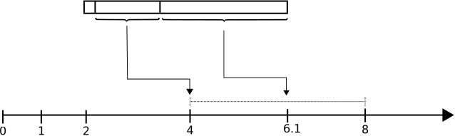

### _Fibonacci sequence_

The repository is about shooting large occurences of the [**Fibonacci numbers**](https://en.wikipedia.org/wiki/Fibonacci_sequence) ([A000045](https://oeis.org/A000045)). The sequence is often a good pretext for exciting journeys to the heart of computer science and a means for illustrating programming patterns. Recall the sequence $F_{n}$ is defined by the **recurrence relation**:

$$ F_{0}=0, \quad F_{1}=1, \quad n\in \mathbb{N}^{+}, n\gt 1 \to F_{n} = F_{n-1} + F_{n-2} $$

<details>
<summary>Negafibonacci</summary>

Using $F_{n-2} = F_{n} - F_{n-1}$, one can extend the sequence to the relative integers set $\mathbb{Z}$:

$$F_{-n} = \big( -1\big) ^{n+1} \times F_{n}$$

$\quad \quad {\color{red}\dots}, {\color{green}28657}, {\color{red}-17711}, {\color{green}10946}, {\color{red}-6765}, {\color{green}4181}, {\color{red}-2584}, {\color{green}1597}, {\color{red}-987}, {\color{green}610},$ <br/>
$\quad \quad {\color{red}-377}, {\color{green}233}, {\color{red}-144}, {\color{green}89}, {\color{red}-55}, {\color{green}34}, {\color{red}-21}, {\color{green}13}, {\color{red}-8}, {\color{green}5}, {\color{red}-3}, {\color{green}2}, {\color{red}-1},$ <br/>
$\quad \quad 0, {\color{green}1,1,2,3,5,8,13,21,34,55,89,144,233,610,987,1597,2584,4181,\dots}$ <br/>
$\quad \quad {\color{green},573147844013817084101_{101},\dots, 638817435613190341905763972389505493_{173},\dots}$
</details>

<details>
<summary>Machine code</summary>

Hexadecimal representation of a `x86-64` [machine code](https://en.wikipedia.org/wiki/Low-level_programming_language) function that calculates the $n^{th}$ Fibonacci number, with each line corresponding to one instruction:

```javascript
89 f8
85 ff
74 26
83 ff 02
76 1c
89 f9
ba 01 00 00 00
be 01 00 00 00
8d 04 16
83 f9 02
74 0d
89 d6
ff c9
89 c2
eb f0
b8 01 00 00
c3
```
</details>

<details>
<summary>Assembly code</summary>

Same Fibonacci calculator, but in `x86-64` assembly language using `AT&T` syntax:

```assembly_x86
fib:
        movl %edi, %eax        ; put the argument into %eax
        testl %edi, %edi       ; is it zero?
        je .return_from_fib    ; yes - return 0, which is already in %eax
        cmpl $2, %edi          ; is 2 greater than or equal to it?
        jbe .return_1_from_fib ; yes (i.e., it's 1 or 2) - return 1
        movl %edi, %ecx        ; no - put it in %ecx, for use as a counter
        movl $1, %edx          ; the previous number in the sequence, which starts out as 1
        movl $1, %esi          ; the number before that, which also starts out as 1
.fib_loop:
        leal (%rsi,%rdx), %eax ; put the sum of the previous two numbers into %eax
        cmpl $2, %ecx          ; is the counter 2?
        je .return_from_fib    ; yes - %eax contains the result
        movl %edx, %esi        ; make the previous number the number before the previous one
        decl %ecx              ; decrement the counter
        movl %eax, %edx        ; make the current number the previous number
        jmp .fib_loop          ; keep going
.return_1_from_fib:
        movl $1, %eax          ; set the return value to 1
.return_from_fib:
        ret                    ; return
```
</details>

### Golden ratio

Fibonacci numbers are strongly related to the **golden ratio**. The figure is a captivating journey through art and architecture, botany and biology, physics and, of course, mathematics. It was called by _Euclid_ **extreme and mean ratio** and **divine proportion** by _Luca Pacioli_.

 **Euclid**'s **Elements** book (_~300b.c._) provides several propositions along with their proofs involving the golden ratio and contains its first known definition which proceeds as follows:

> **Elements / Liber VI / Definition 3**
>
> Ακρον καὶ μέσον λόγον εὐθεῖα τετμῆσθαι λέγεται, ὅταν ᾖ ὡς ἡ ὅλη πρὸς τὸ μεῖζον τμῆμα, οὕτως τὸ μεῖζον πρὸς τὸ ἔλαττὸν.
>
> > _A straight line is said to have been cut in extreme and mean ratio when, as the whole line is to the greater segment, so is the greater to the lesser._

The $11^{th}$ proposition of book $\text{II}$ offers a construction method for the golden ratio.


The **Elements**, written in thirteen books (i.e. chapters) is the most famous and scientifically most significant work by the Greek mathematician Euclid. After the Bible, it is the most printed and studied book in the history of the western world. It represents geometry as a logically self-​contained system built on a **handful of definitions, postulates and axioms**. Besides geometry grounds, it contains everything known at that time about number theory. Here too there were for the first time important findings on prime numbers.

As famous problem from his book **Liber abaci** shows, **Fibonacci** was familiar – in Euclid's tradition – with the concept of proportion in accordance with what was first termed golden ratio only in the $19^{th}$ century. However Fibonacci did not make any connection between the quotient and the sequence of numbers that he found with the **rabbit problem**.

**Calculation**

Algebraically, two quantities $a$ and $b$ with $a\gt b\gt 0$ are said in the **golden ratio** $\varphi$ if their ratio is the same as the ratio of their sum to the larger of the two quantities.

$$\cfrac{a+b}{a} = \cfrac{a}{b} = \varphi$$

One method for finding a closed form for $\varphi$ starts from the left fraction.

$$\cfrac{a+b}{a} = 1 + \cfrac{b}{a} = 1 + \cfrac{1}{\varphi} = \varphi \iff \varphi^{2} - \varphi - 1 = 0$$

Solving the quadratic equation yields to two real solutions. Since $\varphi$ connects together two positive quantities, the positive _root_ is necessarily the golden ratio:

$${\color{navy}\varphi = \cfrac{1 + \sqrt{5}}{2} \sim 1.6180339887} \quad \mid \quad \varphi' = \cfrac{1 - \sqrt{5}}{2} = - \cfrac{1}{\varphi}$$

**Illustrations**

| Quantities | Pentagram | Triangle |
|:---:|:---:|:---:|
|  |  |  |
| The whole is the longer part plus the shorter part. The whole is to the longer part as the longer part is to the shorter part. | A pentagram colored to distinguish its line segments of different lengths. The four lengths are in golden ratio to one another. | A golden triangle ABC can be subdivided by an angle bisector into a smaller golden triangle CXB and a golden gnomon XAC. |

### Expressions

There are several methods for computing the value of a given $n^{th}$ term of Fibonacci sequence.

**Closed-form formula**

Here the expression of one $n^{th}$ term is not a function of some previous terms. Like every sequence defined by a _linear recurrence with constant coefficients_, the Fibonacci sequence has got a closed-form expression. It has become known as **Binet's formula**, named after the french mathematician, though it was already known by _Abraham de Moivre_ (1718) and _Leonhard Euler_ (1765):

$$F_{n} = \cfrac{1}{\sqrt{5}} \Big( \varphi^{n} - \varphi'^{n} \Big) = \cfrac{1}{\sqrt{5}} \Big[ \Big( \cfrac{1 + \sqrt{5}}{2} \Big)^{n} - \Big( \cfrac{1 - \sqrt{5}}{2} \Big)^{n} \Big]$$

One can quickly notice that the second term's absolute value is always less than $0.5$ for all $n\ge 0$, and more, it decreases exponentially. Hence, one could compute $F_{n}$ by **rounding**, using the _nearest integer function_:

$$\forall n\in \mathbb{N}^{+} \to F_{n} = \Big\lfloor \cfrac{\varphi^{n}}{\sqrt{5}} \Big\rceil$$

Though the golden ratio $\varphi$ and its conjugate $\varphi'$ constitute a pair of irrational numbers (each offsets other's infinity), yet the expression result is an integer number.

**Matrix form**

The _2-dimensional_ system of linear difference equations that describes the Fibonacci sequence is:

$$  (a) \quad
    \overrightarrow {F_{n}} =
    \begin{bmatrix}
    F_{n} \\
    F_{n-1}
    \end{bmatrix}
    =
    \begin{bmatrix}
    1 & 1 \\
    1 & 0
    \end{bmatrix}
    \begin{bmatrix}
    F_{n-1} \\
    F_{n-2}
    \end{bmatrix} 
    \implies (b)
    {\color{navy}
    \quad
    \begin{bmatrix}
    1 & 1 \\
    1 & 0
    \end{bmatrix} ^{n}
    =
    \begin{bmatrix}
    F_{n+1} & F_{n} \\
    F_{n} & F_{n-1}
    \end{bmatrix}} $$

The second _innocent-looking_ **matrix exponentiation** identity can be proven from weak
_induction_ as follows:

- **Base case** for $n=1$, clearly:

$$ \begin{bmatrix}
    1 & 1 \\
    1 & 0
    \end{bmatrix} ^{1}
    =
    \begin{bmatrix}
    F_{2} & F_{1} \\
    F_{1} & F_{0}
    \end{bmatrix} $$

- **Induction step**, assume for $n\gt 1$:

$$  \begin{bmatrix}
    1 & 1 \\
    1 & 0
    \end{bmatrix} ^{n}
    =
    \begin{bmatrix}
    F_{n+1} & F_{n} \\
    F_{n} & F_{n-1}
    \end{bmatrix} $$
    
Then, one can induce the equation remains verified for $(n+1)$ since:

$$  \begin{bmatrix}
    1 & 1 \\
    1 & 0
    \end{bmatrix} ^{n+1}
    = 
    \begin{bmatrix}
    F_{n+1} & F_{n} \\
    F_{n} & F_{n-1}
    \end{bmatrix}
    \begin{bmatrix}
    1 & 1 \\
    1 & 0
    \end{bmatrix}
    =
    \begin{bmatrix}
    F_{n+1}+F_{n} & F_{n+1}+0 \\
    F_{n}+F_{n-1} & F_{n}+0
    \end{bmatrix}
    =
    \begin{bmatrix}
    F_{n+2} & F_{n+1} \\
    F_{n+1} & F_{n}
    \end{bmatrix} 
    =
    \begin{bmatrix}
    F_{(n+1)+1} & F_{(n+1)} \\
    F_{(n+1)} & F_{(n+1)-1}
    \end{bmatrix} $$

**Double identities**

The sequence has remarkable properties whom studies are the subject of regular publications. Three following equations are derived by applying $2n$ to the above matrix expression, like so:

$$  \begin{bmatrix}
    {\color{green}F_{(2n)+1}} & {\color{blue}F_{(2n)}} \\
    {\color{blue}F_{(2n)}} & {\color{red}F_{(2n)-1}}
    \end{bmatrix}
    =
    \begin{bmatrix}
    1 & 1 \\
    1 & 0
    \end{bmatrix} ^{(2n)}
    =
    \bigg[ \begin{bmatrix}
    1 & 1 \\
    1 & 0
    \end{bmatrix}^{n} \bigg] ^{2}
    =
    \begin{bmatrix}
    F_{n+1} & F_{n} \\
    F_{n} & F_{n-1}
    \end{bmatrix}^{2}
    =
    \begin{bmatrix}
    {\color{green}F_{n+1}^{2}+F_{n}^{2}} & {\color{blue}F_{n+1}\text{ }F_{n}+F_{n}\text{ }F_{n-1}} \\
    {\color{blue}F_{n}\text{ }F_{n+1}+F_{n-1}\text{ }F_{n}} & {\color{red}F_{n}^{2}+F_{n-1}^{2}}
    \end{bmatrix} $$

By equating each respective cell of the first and last terms, some _identities_ are deduced directly or via the sustitution:

$$ F(2n)=F_{n} \big( F_{n+1} + F_{n-1} \big)= F_{n} \big( F_{n+1} + \big(F_{n+1} - F_{n}\big) \big) = F_{n} \big( 2 \times F_{n+1} - F_{n}\big) $$

Therefore,

$${\color{green} (i) \to F_{2n-1} = F_{n}^{2} + F_{n-1}^{2}} \quad {\color{blue}(ii) \to F_{2n} = F_{n} \times \Big[2\times F_{n+1} - F_{n}\Big]} \quad {\color{red}(iii) \to F_{2n+1} = F_{n+1}^{2} + F_{n}^{2}}$$

Other notable properties:

- Cassini's identity is $F_{n-1}F_{n+1} - F_{n}^{2} = (-1)^{n}$
- Addition rule is $F_{n+p} = F_{p}F_{n+1} + F_{p-1}F_{n} = F_{n}F_{p+1} + F_{n-1}F_{p}$
- Greatest common denominator (_gcd_) identity is $gcd(F_{n}, F_{p}) = F_{gcd(n,p)}$

<details>
<summary>Matrix multiplication</summary>

This binary operation is central tool of linear algebra and has numerous applications in applied mathematics, statistics, physics, economics and engineering.

| Multiplicity | Operations |
|:---:|:---:|
|  |  |
| The number of columns in the first matrix must be equal to the number of rows in the second. The result matrix has the number of rows of the first and the number of columns of the second matrix. | The figure above illustrates diagrammatically the product of two matrices **A** and **B**, showing how each intersection in the product matrix is equal to the **sumproduct** of the correspondings row in **A** and column in **B**. |
</details>

### Algorithms

Keep in mind that a computer performs operations at same speed regardless of the source code or instructions given. It just depends on hardware specifications. It turns out the performance of one method stems from the efficiency of the set of instructions to get as close as possible to the computing power and to run the _straightest through the process_ to achieve the desired result. In other words, the processor does not care how clever or redundant its instructions are, it will execute at the same rate. The outperformance of one algorithm over another arises solely from human reasoning, considered as intelligence, and in regards with the current context.

**Textbook recursive**

Naively, one can execute directly the recurrence formula as Fibonacci sequence is inherently recursive. Unfortunately this would turn to be hopelessly slow as one will immediately understand that the subproblem redundancy grows exponentially in $O(\varphi^{n})$ ($F_{n-1},\dots, F_{0}$). The number of stack frames and operations are proportional to the final numeric answer.

Paired with a lookup table (e.g. **cache**, **memoïzation**) that stores the results of previously solved subproblems, the programming pattern ensures unique instance computation, bringing back time complexity to somewhat linear $O_{n}$.

**Iteration** Both the starting points and the number of iterations to climb the ladder of the sequence are well known ahead. It could also be returned via a generator `function*`.

In regards with Fibonacci, both approaches actually are performing almost equally, in $O_{n}$, when executing the sequence along the full path.

<details>
<summary>Dynamic programming</summary>

Recursion and iteration are equally expressive. The former can be replaced by the latter with eventually an _explicit call stack_, while iteration can be turned into _tail_ recursion (_tail call elimination_).

$$\text{iteration } + \text{ tabulation} \to \text{bottom-up approach}$$

$$\text{recursion } + \text{ memoïzation} \to \text{top-down approach}$$

Generally, two properties of a problem should be observed while considering dynamic programming:

1. **Subproblem redundancy**, meaning valid results to smaller instances are useful numerous times to solve one larger instance of the problem. _Fibonacci sequence_ ticks the box big time!

2. **Subproblem optimality**, meaning an optimal solution of the larger instance is obtained thanks to the optimal results of each subproblem, instead of trying every possible valid ways. (e.g. _shortest path search_ meets the property whereas _longest path search_ does not). Here again, the problem at hand comply with this principle.

A primary difference is that recursion can be employed as a solution without prior knowledge as to how many times the process will have to repeat, or as to how the problem will exactly destructure into smaller instances, while a successful iteration requires that foreknowledge. Implementing an algorithm using iteration may not be easily achievable. Many problems are inherently recursive: e.g. **multiple recursion** like _dfs_, **generative recursion** such as _gcd_, _binary search_, _mergesort_, etc. They may be implemented iteratively with the help of an explicit stack, but the programmer effort involved in managing the stack, and the complexity of the resulting program, arguably outweigh any advantages of the iterative solution.
</details>

<details>
<summary>Iterative code</summary>

```javascript
let dynamic = (n) => {let [a, b]=[1, 0]; for (let i=2; i<=n; i++) {[a, b]=[a + b, a];}; return a;};
```
</details>

**Matrix exponentiation**

The algorithm is calculating the simple-looking matrix form $(b)$ of the Fibonacci sequence.

$$  (b)
    \to
    \begin{bmatrix}
    1 & 1 \\
    1 & 0
    \end{bmatrix} ^{n}
    =
    \begin{bmatrix}
    F_{n+1} & F_{n} \\
    F_{n} & F_{n-1}
    \end{bmatrix} $$

Running the equation step by step, $F_{1},\dots,F_{n-1},F_{n}$, would degenerate into the vanilla formula already dynamically programmed. Good news! The left hand-side shifts to a multiplicative operator instead of the additive recurrence $F_{n}$ meaning one can leverage on the tactic of **exponentiation by squaring**.

**Binary exponentiation** is a general method for faster computation of large powers of a number, or a _square matrix_ (also called _double and add_). It is a corollary of the powerful **divide and conquer** algorithm paradigm. The process consists of repeatedly computing the _squaring_ of $x$ on the observation that for any $n$:

$$  x^{0}=1
    \quad \mid \quad
    n\in \mathbb{N}^{+} x^{n} =
    \begin{cases}
        \big(x^{2}\big)^{n/2} & n_{even} \\
        x\big(x^{2}\big)^{(n-1)/2} & n_{odd}       
    \end{cases}
    \quad \mid \quad
    n\in \mathbb{Z}^{-} x^{-n} \iff \Big(\cfrac{1}{x}\Big)^{n} $$

Combined with the [**binary expression**](https://en.wikipedia.org/wiki/Binary_number) of the exponent $n$, the algorithm conveniently loops to calculating the power $2$ of the result of the preceeding iteration. Where,

- The total number of squaring operations, also of iterations, is equal to the number of _bits_, i.e. $\lfloor log_{2}\text{ }n\rfloor$.<br/>Each of these steps doubles the exponentiation.

- A complementary simple multiplication by $x$ is performed when the iterated _bit_ is $1$.<br/>This increments the exponent by $1$ only.

Logarithmic time complexity $O(log_{n})$ of this algorithm outperforms big time the trivial method which runs linearly in $O(n)$. Indeed, evaluating $F_{123456}$ takes only $17$ iterations with this process, while it will require $123 \text{ } 456$ loops with a coding pattern that sticks to the vanilla Fibonacci formula.

<details>
<summary>Calculation example</summary>

Exponentiation by squaring for $\alpha^{n}$ with $n=38$. Recall in binary:

$\quad 38_{10} = (2^{5}\times {\color{blue}1}) + (2^{4}\times {\color{blue}0}) + (2^{3}\times {\color{blue}0}) + (2^{2}\times {\color{blue}1}) + (2^{1}\times {\color{blue}1}) + (2^{0}\times {\color{blue}0}) = 32+0+0+4+2+0 = {\color{blue}100110}_{2}$.

| _i_ | bit | $\alpha^{n}_{start}$ | $n_{start}$ | operation | $n_{end}$ | result |   |
|-----|-----|-----|-----|-----|-----|-----|:----|
| 0 | ${\color{blue}1}00110$ | $\alpha^{0} = 1$ | $0$ | $\alpha^{2}\times \alpha^{1} = \alpha^{1}$ | $1$ | $\alpha$ | **MSb** _most significant bit_ |
| 1 | $1{\color{blue}0}0110$ | $\alpha^{1}$ | $1$ | $(\alpha^{1})^{2}$ | $2$ | $\alpha^{2}$ |
| 2 | $10{\color{blue}0}110$ | $\alpha^{2}$ | $2$ | $(\alpha^{2})^{2}$ | $4$ | $\alpha^{4}$ |
| 3 | $100{\color{blue}1}10$ | $\alpha^{4}$ | $4$ | $(\alpha^{4})^{2}\times \alpha^{1}$ | $9$ | $\alpha^{9}$ |
| 4 | $1001{\color{blue}1}0$ | $\alpha^{9}$ | $9$ | $(\alpha^{9})^{2}\times \alpha^{1}$ | $19$ | $\alpha^{19}$ |
| 5 | $10011{\color{blue}0}$ | $\alpha^{19}$ | $19$ | $(\alpha^{19})^{2}$ | $38$ | $\alpha^{38}$ | **LSb** _least significant bit_ |

In the end, the framework has performed $(c_{i}) \to \alpha^{38} = \Big[\big(\big(\big(\big(\big(\alpha^{0} \times \alpha\big) _{{\color{blue}1}}^{2}\big) _{{\color{blue}2}}^{2} \big) _{{\color{blue}4}}^{2} \times \alpha \big) _{{\color{blue}9}}^{2} \times \alpha \big) _{{\color{blue}19}}^{2}\Big] _{{\color{blue}38}}$.

Alternatively, one may also process according to $(c_{ii}) \to \alpha^{100110_{2}} = \alpha^{2^{5}} \times \alpha^{2^{2}} \times \alpha^{2^{1}} = \alpha^{32} \times \alpha^{4} \times \alpha^{2}$.
</details>

<details>
<summary>Programming examples</summary>

Illustration of computation table above, running binary representation from _left_ to _right_ (**MSb** to **LSb**)

```javascript
const formula_i = (x, n) => {let exp = 1, binary = n.toString(2);
	for (let bit of binary) {exp *= exp; if (bit == 1) {exp *= x;};}; return exp;};
```

Alternative formula (though not preferred) running binary array from _right_ to _left_ (**LSb** to **MSb**).

```javascript
const formula_ii = (x, n) => {let exp = 1, binary = n.toString(2), i = binary.length - 1;
	do {if (binary[i] == 1) {exp *= x;}; x *= x;} while (i--); return exp;};
```

Iterative version with constant auxiliairy memory `y`. 

```javascript
function exponentiationBySquaring (x, n) {
    if (n < 0) {x = 1 / x; n = -n;};
    if (n == 0) {return 1;};
    let y = 1; // stores the complementary simple multiplications
    while (n > 1) {
        if (n % 2 != 0) {y *= x; n -= 1;}
        else {x *= x; n /= 2;};
    };
return x * y;};
```

Version performing a fixed quantity of operations (multiplications and squarings) regardless of specific's bit value for cryptographic concerns.

```javascript
function MontgomeryLadder (x, n) {
    let [x1, x2] = [x, x * x]; let base = n.toString(2);
    for (let i = 1; i < base.length; i++) {
        if (base[i] == 0) {[x1, x2] = [x1 * x1, x1 * x2];}
        else {[x1, x2] = [x1 * x2, x2 * x2]};
    };
return x1;};
```
</details>

<details>
<summary>Generalized exponentiation</summary>

Exponentiation by _squaring_ can be viewed as a suboptimal **addition-chain** exponentiation algorithm. Equivalently, it is the minimal number of multiplications required to compute the $n^{th}$ power. The determination of a shortest addition chain is _hard_ meaning no efficient optimal methods are currently known for arbitrary exponents. The problem has been proven **NP-complete**.
</details>

**Fast double**

The matrix exponentiation method allows for working fast the sequence up to determining a great Fibonacci number while before it was endlessly slow. Nevertheless, computing the whole matrix ends up to redundant calculations as various cells contain identical values. Using the **double identities** instead addresses this concern.

$$ (ii) \to F_{2n} = F_{n} \times \Big[2\times F_{n+1} - F_{n}\Big] $$

$$ (iii) \to F_{2n+1} = F_{n+1}^{2} + F_{n}^{2} $$

It is worth pointing out the **strength of pair induction** versus a simple relation which can lead to a dead-end or to partial sequencing. Indeed, a single induction like $n\to 2n$ would only jump onto _doubles_ like so $F_{1} \to F_{2} \to \dots \to F_{2^{k}}$ which is not sufficient. On the contrary, multiple induction allows to calculate indefinitely any values of the sequence. First, one starts with $n$ and its adjacents $(n-1)$ $(n+1)$, then induces $(2n-1), (2n), (2n+1)$, which can be pursued thereafter independently from any of the three latter points (somehow _horizontally_ and _vertically_), and so on, over again, leading to infinite induction and complete sequencing.

$$  \begin{cases}
        F_{0} \\
        F_{1} \\
        F_{2}
    \end{cases}
    \quad \to
    \begin{cases}
        F_{n-1} \\
        F_{n} \\
        F_{n+1}
    \end{cases}
    \quad \dots \quad \to
    \begin{cases}
        F_{2n-1} \\
        F_{2n} \\
        F_{2n+1}
    \end{cases}
    \text{or}
    \begin{cases}
        F_{2n+1} \\
        F_{2n+2} \\
        F_{2n+3}
    \end{cases}
    \text{ or}
    \begin{cases}
        F_{2n-3} \\
        F_{2n-2} \\
        F_{2n-1}
    \end{cases}
    \quad \dots \to
        \begin{cases}
        F_{4n-1} \\
        F_{4n} \\
        F_{4n+1}
    \end{cases}
    \text{or}
    \begin{cases}
        F_{4n+1} \\
        F_{4n+2} \\
        F_{4n+3}
    \end{cases}
    \dots \text{or}
    \begin{cases}
        F_{4n-3} \\
        F_{4n-2} \\
        F_{4n-1}
    \end{cases}
    \quad \dots \to $$

<details>
<summary>Iterative IIFE</summary>

```javascript
const iterativeWrappedIIFE = (n) => 
    (func => ((n) || (n % 2)) ? func(Math.abs(n)) : -func(Math.abs(n))) // negafibonacci
    (function fibonacci (n) {
        n = n.toString(2); // exponent binary notation
        let [f_2n1, f_2n] = [1n, 0n]; // initialization
    	for (let i = 0; i < n.length; i++) {
            [f_2n1, f_2n] = [(f_2n1 * f_2n1) + (f_2n * f_2n), f_2n * (f_2n1 * 2n - f_2n)];
            if (n[i] == 1) {[f_2n1, f_2n] = [f_2n1 + f_2n, f_2n1];};};
    return f_2n;}
    );
```
</details>

**Binet's turnaround**

Since the closed expression requires dealing with irrational $\sqrt{5}$, it has to cope with _floating-point_ imprecision. Hence, in its pure form, it is actually of little use for practical implementations. Approximations and errors prompt as early as $n\gt 70$. Currently, with the JavaScript code at hand, `Math.sqrt(5)` begins pushing deviation from $F_{79}$.

<details>
<summary>Windows calculator</summary>

Computing directly $\varphi$ via the Microsoft operating system embedded calculator, one can nevertheless check that precision works fine for higher instances of the sequence (checked by [prime factorization](https://mersennus.net/fibonacci/f1000.txt)). This is because the software is using an **arbitrary-precision arithmetic** library (_bignum_ or _infinite_ precision), replacing the IEEE 754-1985 _double precision_ format since its Windows 98 version. For example:

$$\quad F(500) \approx \Big \lfloor \Big(\cfrac{\sqrt{5}+1}{2}\Big)^{500} \Big\rceil$$

$\quad F(500) = 3\times 5^{3}\times 11\times 41\times 101\times 151\times 251\times 401\times 3001\times 570601\times 112128001\times 1353439001\times$ <br/>
$\quad 28143378001\times 5465167948001\times 84817574770589638001\times 158414167964045700001 $
`// true`
</details>

**Symbolic algebra** approach can remove the floating-point difficulty provided with $\varphi$ and $\varphi'$. The idea is to not compute $\sqrt{5}$. It consists of setting a representation $\alpha=(a,b)$ analogous to _complex numbers_:

$$\alpha = (a,b) \iff \alpha = \cfrac{1}{2}\times (a+b\sqrt{5})$$

- $a$ and $b$ being respectively the **real** and **algebraic** parts of $\alpha$.
- Obviously, $(1,1)\iff \varphi$ and $(1,-1)\iff \varphi'$. Besides $(2,0)\iff 1$.

Using this notation it can be simply developed $\alpha^{2}$:

$$\quad \alpha^{2} = \big(\cfrac{1}{2}\times (a+b\sqrt{5}) \big)^{2} = \cfrac{1}{4}\times \big( (a^{2} + 5b^{2}) + 2ab\sqrt{5}\big) = \cfrac{1}{2}\times \Big(\cfrac{a^{2} + 5b^{2}}{2} + ab\sqrt{5}\Big)$$

$$\iff \alpha^{2} = (a',b') = \Big(\cfrac{a^{2} + 5b^{2}}{2}\text{ },\text{ }ab\sqrt{5}\Big)$$

Similarly, one can obtain the representation $\varphi \times \alpha$:

$$\varphi \times \alpha = \Big(\cfrac{a+5b}{2}\text{ },\text{ }\cfrac{a+b}{2}\Big)$$

Thanks to the two operations, it can also be undertaken one pairing $(a,b)$ for which $\varphi^{n} = (a,b)$ and $(\varphi')^{n} = (a,-b)$. Then substituting in Binet's formula,

$$\quad F_{n} = \cfrac{1}{\sqrt{5}} \Big( \varphi^{n} - \varphi'^{n} \Big) = \cfrac{1}{\sqrt{5}} \Big[ \cfrac{1}{2} \times \Big(a + b\sqrt{5}\Big) - \cfrac{1}{2} \times \Big(a - b\sqrt{5}\Big) \Big] = \cfrac{a}{2\times \sqrt{5}} + \cfrac{b}{2} - \cfrac{a}{2\times \sqrt{5}} + \cfrac{b}{2}$$

It is deduced the **straightforward** and surprisingly **costless result**:

$$F_{n} = {\color{blue}b} \gets \varphi^{n} = (a,{\color{blue}b})$$

Obviously this approach is meant to be run using **binary exponentiation**.

<details>
<summary>Caveat</summary>

Before running this algorithm, one needs to align the output initialization with the loop index.

- `[a,b] = [2,0]` means $(2,0)\iff 1$. Loop traverses binary array from most left `bit[0] = 1`.
- `[a,b] = [1,1]` means $(1,1)\iff \varphi$. Loop traverses binary expansion from second `bit[1]`.
</details>

### Complexities

Programming patterns of the Fibonacci sequence exhibit a large range of algorithm classes and time complexities:

| Method | Time | Comment |
|:-------|:-----|:--------|
| Textbook | $O(2^{n})$ | $F_{45} \to \text{ } \gt 30s$, runs $3\text{ }672\text{ }623\text{ }805$ calls! | 
| Cached recursion | $O(n)$ | `node.js` default stack size is exceeded beyond $F_{8400}$ | 
| Tabulated iteration | $O(n)$ | runtime for $F_{1\text{ }000\text{ }000} \to 7.0s \sim 7.5s$ |
| Matrix exponentiated | $O(log_{n})$ | $F_{1\text{ }000\text{ }000} \to 110ms$ (redundant computations) |
| Fast double | $O(log_{n})$ | $F_{1\text{ }000\text{ }000} \to 40ms\sim 45ms$ |
| Binet algebraic | $O(log_{n})$ | $F_{1\text{ }000\text{ }000} \to 40ms\sim 45ms$ |

Here a good illutration that **bisect paradigm** is **a paramount optimization tool** which often leads to an improvement of the **asymptotic cost** of the solution. If $(i)$ the base cases have constant-bounded size, the work of splitting the problem and combining the partial solutions is proportional to the problem's size $n$, and $(ii)$ there is a bounded number $p$ of sub-problems of size  $\displaystyle \sim n/p$ at each stage, then the cost of the algorithm will be **logarithmic** like so $O(n \text{ } log_{p} n)$.

Some notable examples of _divide-and-conquer_ frameworks:
- The **mergesort** algorithm, invented by _John von Neumann_ in 1945, specifically developed for computers,
- The ancient _Euclidean_ algorithm to determine the **greatest common denominator** of two numbers,
- The **Karatsuba** algorithm that achieves multiplication of two $n$-digits integers in $O(n^{log_{2}^{3}})$.

In computer science, $O$ notation characterizes the **asymptotic analysis** of an algorithm or a function when the argument tends towards _infinity_ typically, or sometimes towards a particular value. The letter $O$ was chosen by its inventor Paul Bachmann to stand for _Ordnung_, meaning _order of approximation_.

It is very useful to **classify algorithms for efficiency**. What matters is the **growth rate** and $O$ focuses on the **upper bound** (e.g. _worst-case_) of the growth rate of the function. In this setting, the contribution of the terms that grow _most quickly_ will eventually make the other ones irrelevant. As a result, these simplification rules can be applied:

- When $f(x)$ is a sum of several terms and one has a larger growth rate, it can be kept while all others omitted.
- When $f(x)$ is a product of multiple terms, any constants (not dependent on $x$) can be omitted.

Therefore both $f(x)=x$ and $g(x)=\text{ }^{x}/_{2}$ are in $O(x)$, while $h(x)=6x^{4}-100x^{3}+9$ is in $O(x^{4})$.

Moreover, the precise number of steps depends on the details of the machine model on which the algorithm executes, but different computers typically vary by a constant factor so $O$ notation captures the essence of reasoning. Besides, it does not enlighten much to detail how exactly an algorithm is fast or slow especially because a computer tomorrow will likely be faster than the one today! 

<details>
<summary>Clock rate</summary>

Aside from algorithm efficiency, hardware specifications matters!

The performance of a computer is very dependent on the **Central Processing Unit**, the _brain of the PC_. The **CPU** processes instructions from all different programs every second. Some of these instructions involve simple arithmetic while others are more complicated.

The **clock speed** measures the number of **cycles** the CPU executes per second, measured in _GHz_ (Gigahertz). A cycle is the basic unit that measures the speed of the CPU. During each cycle, billions of transistors within the processor open and close. This is how the CPU executes the calculations contained in the instructions it receives. Sometimes, multiple instructions are completed in a single clock cycle. In other cases, one instruction might be handled over multiple clock cycles.

Different processor designs handle instructions differently. Moreover, one older chip with a higher clock speed may very well be outperformed by a slower but newer processor whom architecture deals with instructions more efficiently. Of course, there are many other factors to consider when measuring the performance index of a computer such as data bus, latency of memory, architecture, microarchitectures, cache, etc.

The speed of floating-point operations, commonly measured in terms of **FLOPS**, is an other important characteristic of a computer system. A floating-point unit (**FPU**, colloquially a math coprocessor) is a part of a computer system specially designed to carry out operations on floating-point numbers.
</details>

In a nutshell, one algorithm time complexity could be intuitively spotted like so:

| With this rule of thumb, chances are... | notation | class | example |
|:---------|:------|:--------------|:--------|
| Whenever the number of steps is _constant_ whatever the size of the input ($1$, $5$ even $47$ steps but fixed!) | $O(1)$ | constant | lookup table |
| Anytime a problem can be _divided_ over again into $k$ smaller identical subproblems | $O(log_{k}n)$ | logarithmic | binary search |
| Whenever algorithm is _linearly_ processing $k$ actions for each input but traverses the input only one time | $O(n)$ | linear | read the book |
| When it involves _walking through the input about input times_, or keeps _swooping through_ with nested loops | $O(n^{2})$ | quadratic | school multiplication, bubblesort |
| Anytime the growth rate in time _doubles_ or $k$ _multiplies_ for each increment to the input size | $O(k^{n})$ | exponential | plain Fibonacci, <br/> password bruteforce |
| When the running time grows in a factorial way like for generating all unrestricted permutations | $O(n!)$ | factorial | travelling salesman problem via bruteforce |

Generally speaking, sublinear time is considered fast whereas complexities higher than **linearithmic** are rather said slow. Typically there is a **tradeoff** **time vs. space** (more relevant decades ago than nowadays since space has become cheap) or **time over intelligence** (e.g. effort in writing a more sophisticated model).

To end with, together with $O$ notation for worst-case classification, there exists the corresponding notations:
- $\Omega$ is expressing the lower bound, i.e. the _best case_, of the algorithm,
- $\Theta$ is used when $O = \Omega$.

**Illustrations**

| merge sort | binary search | hash table |
|:---------:|:-------------:|:----------:|
|  |  |  |
| Mergesort is an efficient **linearithmic** general-purpose sorting algorithm. Most implementations are stable meaning the relative order of equal elements remains. | It runs in logarithmic time in worst-case and can solve a wide range of problems like finding the _next smallest_ or _next largest_ item relative to a target. | Associative array that maps keys to values, uses a **hash code** to compute an index from which the desired value is found. On average more efficient than search trees. |

<details>
<summary>Sleep sort!</summary>

**Sleep sort** is undoubtedly one of the most ingenious sorting algorithm. Many methods use strategies based on the _divide-and-conquer_ principle to get an array sorted more efficiently. Here the idea though unconventional is incredibly simple. For each element it opens up a new thread that sleeps for an amount of time proportional to its value and once time is out, it simply emits the item. Elements are then collected sequentially in time. The sorting is brilliantly delegated to the CPU scheduler (e.g. _JS event loop_).

Needless to say, generally speaking, one **algorithm effectiveness depends on the given population** to be sorted. For example, whenever a few elements have a much higher value (in magnitude) than the rest of the cluster, the sorting process will be penalized efficient by the extra time taken for those specific values.

```javascript
Array.prototype.sleepSort = function (f) {this.forEach((n) => setTimeout(() => f(n), 2 * n));};

[1,9,6,7,3,4,0,5,8,2].sleepSort(function (i) {document.write(i + '<br>');});
// emits the element after 2 times its value in milliseconds
```

```javascript
Array.prototype.fisherYates = function () {let i = this.length - 1;
    do {let j = ~~(Math.random() * (i+1)); [this[i],this[j]] = [this[j],this[i]];} while (--i);};
// Modern version of the Fisher–Yates shuffle algorithm
```

```javascript
Array.prototype.sleepSort = function (callback) {let sorted = [];
    for (let n of this) {setTimeout(() => {
        sorted.push(n); if (this.length === sorted.length) {callback(sorted);};}, n);};
    return sorted;};
// returns the sorted array (positive values), each item is pushed after its n time (ms)

[18,12,21,8,7,10,1,16,11,2,19,17,22,9,20,4,23,25,14,5,15,13,6,3,24].sleepSort(console.log);
// [1,2,3,4,5,6,7,8,9,10,11,12,13,14,15,16,17,18,19,20,21,22,23,24,25]
```
</details>

### Miscellaneous [:tada:](https://www.nayuki.io/category/programming)

Occurences of the Fibonacci sequence are countless in life.

It is fair to say $\varphi$ has inspired many greatest minds of all ages and all disciplines like no other number in history. The idea of an omnipresence of the golden ratio is often taken up. Nonetheless, divergence of opinion raises up for the natural sciences because it largely depends on the criteria allowing the golden ratio to be linked or not to a phenomenon.

Here are a selection of _easy access_ use cases involving Fibonacci sequence.

**Miles to kilometers**

Because $1$ mile $\sim 1.609$ meters and $F_{n+1} / F_{n} = \varphi \sim 1.6180$, one practical use of the Fibonacci sequence is converting kilometers to miles for comparing distance measures. Shifting forward one point along the sequence converts to kilometers while one jump backward translates to miles.

- $8$ miles $\to 13$ kilometers, similarly as $F_{5} = 8$ and $F_{5} \times \varphi \sim F_{5+1} = 13$.
- $55$ km/h $\gets 34$ mph follows sequence like so $F_{10} = 55$ and $55 / \varphi \sim F_{9} = 34$.

**Climb the stairs**

Fibonacci numbers give solution to certain enumerative problems, including the **rabbit problem** initiated by Fibonacci himself! One most common is counting the number of ways of writing a given number $n$ as an ordered sum made up of $1$ and/or $2$, i.e. $(1,2)$-**restricted compositions**.

There are actually $F_{n+1}$ compositions.

For example with $n=5$, there are $F_{5+1}=F_{6}=8$ ways one can climb a staircase of $5$ steps, taking either one or two steps at a time.

$\quad n=5$ <br/>
$\quad =(1+1+1+1+1) _{1} = (2+1+1+1) _{2} = (1+2+1+1) _{3} = (1+1+2+1) _{4} = (2+2+1) _{5}$<br/>
$\quad =(1+1+1+2) _{6} = (2+1+2) _{7} = (1+2+2) _{8}$

The example illustrates the evidence that the number of compositions $C_{n}$ is the sum of:
- $C_{n-1}$, the number of compositions that express $(n-1)$, to which one would add $1$, being also the number of compositions for $C_{n}$ ending with $1$, and 
- $C_{n-2}$, the number of ways to write $(n-2)$, to which one would logically add $2$, also being the number of compositions for $C_{n}$ that ends by $2$.

Given base cases $C_{1}=1\text{ } \big(F_{2}\big)$ and $C_{2}=2\text{ } \big(F_{3}\big)$, hence meaning shifting $1$ increment to get $F_{n+1}\to C_{n}$: 

$$ C_{n} = C_{n-1} + C_{n-2} = F_{n+1} $$

Different _stories told_ for an identical solution are like so:
- Number of ways of **emptying a drum** of $n$ liters with the help of containers of either one or two liters capacity,
- Number of different **domino tilings** of the $2\times n$ plan. 

**Heads or tails**

$F_{n+2}$ is the number of plays $P_{n}$ for a serie of draws with length $n$ without consecutive _tails_. For example, out of the $16$ binary string possibilities for a game of length $n=4$, there are $F_{6}=8$ without two _tails_ in a row:

$\quad 0000, 0001, 0010, 0100, 0101, 1000, 1001$ and $1010$. (_tails_ $\to 1$, _heads_ $\to 0$)

In order to build a game of length $n$ where no two consecutive _tails_ are drawn, one can either start with a _heads_ plus a game of length $(n-1)$, or start with a _tails_ $+$ _heads_ then a game of length $(n-2)$. Hence $P_{n} = P_{n-1} + P_{n-2}$.

Given base cases $P_{1}=2\text{ } \big(F_{3}\big)$ and $P_{2}=3\text{ } \big(F_{4}\big)$, hence meaning shifting by $2$ increments to get $F_{n+2}\to C_{n}$:

$$ P_{n} = P_{n-1} + P_{n-2} = F_{n+2} $$

The following problem shares this solution: the number of subsets $S$ in $(1,...,n)$ without consecutive integers.

### Numeral systems

Representing and manipulating real numbers efficiently is required in many fields of science such as engineering, finance and more. Since the early years of electronic computing, many different ways of approximating real numbers on computers have been introduced. **Floating-point arithmetic** is by far the most widely used way of representing real numbers in modern computers.

It is a truism:
- Humans count in _decimal_ basis because they own $10$ fingers!
- Computers are made up of transistors which switch between only two states: either **on** or **off** (_electric current flows or does not pass_). They perform calculations (and actually everything) using the _binary system_ because of its straightforward implementation in **logic gates**.

Expressing one same quantity:

- ${\color{blue}325.1875}_{10} = {\color{blue}3}\times 10^{2} + {\color{blue}2}\times 10^{1} + {\color{blue}5}\times 10^{0} + {\color{blue}1}\times 10^{-1} + {\color{blue}8}\times 10^{-2} + {\color{blue}7}\times 10^{-3} + {\color{blue}5}\times 10^{-4}$
- ${\color{green}101000101.0011}_{2} = {\color{green}1} \times 2^{8} + {\color{green}1} \times 2^{6} + {\color{green}1} \times 2^{2} + {\color{green}1} \times 2^{0} + {\color{green}0} \times 2^{-1} + {\color{green}1} \times 10^{-3} + {\color{green}1} \times 10^{-4}$

The **base-**$2$ numeral system is the **positional notation** with a radix of $2$.

Computers store **bits**, each of which can hold a state either of $1$ or $0$. A **byte** is the unit of digital information that now commonly consists of $8$ bits. As integrated circuit technology advanced, the size of **data objects** became larger. Increasing the transistor count on a chip allowed word sizes to increase from `4-bit` and `8-bit` **words** up to today's `64-bit` **words**. For example, _floating-point arithmetic_ was historically often not available on `8-bit` microprocessors, but had to be carried out in software. Integration of the floating-point unit, first as a separate integrated circuit and then as part of the same microprocessor chip, sped up floating-point calculations.

**Integers**

| bits | unsigned | $2$'s complements | use cases |
|------|:--------:|:-----------------:|----------:|
| `8` | $0$ to $255$ | $-128$ to $127$ | latin character set |
| `16` | $0$ to $65535$ | $-32768$ to $32767$ | graphic coordinates |
| `32` | $0$ to $4294967296$ | $-2147483648$ to $2147483647$ | general purpose |
| `64` | $0$ to $1.8\times 10^{19}$ | $-9\times 10^{18}$ to $9\times 10^{18}$ | general purpose |

**Two's complement** is the almost exclusive method of representing signed integers on computers, and more generally, _fixed-point_ binary values. Two's complement uses the binary digit with the greatest place value as the **sign bit** to indicate whether the binary number is positive ($+$) or negative ($-$). When the most significant bit is $1$, the number is signed as negative. When the most significant bit is $0$ the number is signed as positive.

Two's complement only applies to numbers **all having the same** $n$`-bit` **length**.

Given a set of all possible $n$`-bit` encodings, the lower half (in binary!) is assigned to positive integers $[0\text{},\text{}2^{n-1}-1]$ inclusive, and the upper half (in binary!!) to represent negative integers from $[-2^{n-1}\text{},\text{}-1]$ inclusive. Why it works?! Because under addition _modulo_ $2^{n}$ it behaves the same way as with negative integers. For example, with eight bits, the unsigned numbers are $0$ to $255$. Subtracting $2^{8}=256$ from the top half ($128$ to $255$) yields the signed values $−128$ to $−1$.

| Set | binary range | MSb | encoding | interval |
|-----|-----|-----|-----|-----|
| $\mathbb{N}$ | lower half | **MSb** $=0$ | ${\color{green}0}b_{i-2}...b_{1}b_{0}$ | from $0$ to $(2^{n-1}-1)$ inclusive |
| $\mathbb{Z^{-}}$ | upper half | **MSb** $=1$ | ${\color{red}1}b_{i-2}...b_{1}b_{0}$ | from $-2^{n-1}$ to $-1$ inclusive |

Fundamentally, the system represents negative integers by _counting backward_ and _wrapping around_ (**modular arithmetic**). The boundary between positive and negative subsets could be arbitrarily different but convention is all negative numbers have a left-most bit of $1$.

$\quad N=8$`-bit` integer, $\quad max = +127$<sub>10</sub> $= 0111\text{ }1111$<sub>2</sub> $\qquad \to +1$<sub>2</sub> $\qquad min = 1000\text{ }0000$<sub>2</sub> $= -128$<sub>10</sub>

More generally, the value $v$ of a $n$`-bit` encoded integer $b_{n-1}b_{n-2}...b_{0}$ is given by the following formula:

$\quad v = {\color{red}-}b_{n-1}\times 2^{n-1} + \displaystyle\sum_{i=0}^{n-2} 2^{i}b_{i}$

Overcoming the issues raised by a naïve representation (wrong arithmetic, double zero encoding), the method is carried out like so.
- First, $\mathbb{N^{+}}$ are encoded as usual whereas $\mathbb{Z^{-}}$ are encoded by performing the two consecutive steps:
1. **Flipping** all bits (bitwise operator `NOT` in JavaScript `~`), (e.g. _ones' complement_)
2. **Adding** $+1$ to the entire inverted number, **ignoring any overflow**. Accounting for overflow would produce the wrong value for the result.

With `half`-byte length, encoding $-6$<sub>10</sub> proceeds from $+6$<sub>10</sub> $=0110$<sub>2</sub>, all bits inversed $\to 1001$, adding $+1$<sub>2</sub> $\to 1010$<sub>2</sub>. <br/>
Reversely, to verify that $1010$<sub>2</sub> means $-6$<sub>10</sub>, one computes $1010_{2} = {\color{red}-1\times 2^{3}} + 0\times 2^{2} + 1\times 2^{1} + 0\times 2^{0} = -8 + 2 = -6_{10}$.

<details>
<summary>Signed vs. unsigned</summary>

Given one byte length, _Two's complement_ will encode $-82$ like $+174$ unsigned.

```javascript
       1111 1111                            255
     - 0101 0010                          -  82
    ============                         ======   
       1010 1101    (one's complement)      173
     +         1                          +   1
    ============                         ======
       1010 1110    (two's complement)      174
```
</details>

<details>
<summary>Manual shortcut</summary>

To quickly determine one integer's additive inverse using two's complement expression, one can do by hand:
1. Work from **LSb** $\to$ **MSb** and **keep each bit identical up to the very first** $1$ bit (inclusive) encountered,
2. **Flip all bits thereafter** up to the most-left bit.

Example:
- $76_{10} = 01001100_{2} \to$ flip all: $10110011 \to$ add: $+1 \to$ makes $10110100_{2} = -76_{10}$
- $76_{10} = 01001100_{2} \to$ keep right bits: 01001**100** $\to$ flip thereafter: 10110**100** $\to$ makes $10110100_{2} = -76_{10}$
</details>

<details>
<summary>Weird number</summary>

One exception where the additive inverse of the lowest integer is not representable. One will point out that the two's complement being the same number is detected as an overflow condition since there is a carry into but not out of the most-significant bit. As for $0$, the two's complement is here itself whereas it should not be the case!

$\quad N=8$`-bit` integer, $\quad min = -128$<sub>10</sub> $= 1000\text{ }0000$<sub>2</sub> $\to$ invert bits $0111 1111 \to$ add $+1$<sub>2</sub> $\to 1000\text{ }0000$<sub>2</sub> $= -128$<sub>10</sub>
</details>

**Origin of the name** Expanded fully in a $N$`-bit` system, it actually means _complement to_ $2$ _to the power of_ $N$, almost systematically truncated to _Two's complement_. The method of complements had long been used to perform subtraction in decimal adding machines and mechanical calculators. _John von Neumann_ suggested use of two's complement binary representation in his 1945 _First Draft of a Report on the EDVAC_ proposal for an electronic stored-program digital computer.

Compared to other systems for representing signed numbers (e.g., ones' complement), two's complement has the advantage that the **fundamental arithmetic operations** of addition, subtraction, and multiplication are **identical to** those for **unsigned** binary **numbers** (as long as the inputs are represented in the same number of bits as the output, and any overflow beyond those bits is discarded from the result).

**Subtraction** Using two's complement notation subtraction is executed with the following formula and so is eliminated the need for dedicated circuitry.

$$ \big(A − B \big) = A + NOT \big(B \big) + 1 $$

**Signed extension** When turning a two's complement number from a certain bits length into one larger storage (e.g. copying from $4$-`byte` to $8$-`byte` word), the most significant bit must be repeated in all extra bits. Some processors do this in a single instruction while on other processors, a conditional must be used followed by code to set the relevant bits or bytes.

**Floating-point arithmetic**

Simulating an infinite and continuous set $\mathbb{R}$ with a finite set (_machine numbers_) is not a straightforward task. Clever compromises must be found between speed, accuracy, dynamic range, ease of use, implementation and memory.

[Floating point arithmetic is not real](https://docs.oracle.com/cd/E19957-01/806-3568/ncg_goldberg.html)! The primary use of floating-point arithmetic is to perform computations over real numbers. Due to the limited precision and range of floating-point numbers, various numerical issues arise: rounding errors, overflows, underflows, loss of algebraic properties, catastrophic cancellation, and so on. Yet, these issues did not stop computers from using floating-point arithmetic for serious applications. In fact, it remains one extremely efficient way of performing approximate calculations given sufficient care in the implementation and powerful floating-point units available in modern processors.

The IEEE 754 standard establishes the framework for using a finite pack of bits (e.g. `32`, `64`) to store numbers of a large range, including the **subnormal** floating numbers (extremely close to zero).

Floating point arithmetic represents **subsets** of real numbers using both **scientific notation** and a numeral system, mostly binary. This representation handles with the same number of bits a much wider dynamic range at the price of precision. Numbers are not uniformly spaced and the difference between two consecutive representable numbers varies with their exponent. A floating-point number consists of two fixed-point components, whose range depends exclusively on the number of bits or digits in their representation. Whereas components linearly depend on their range, the floating-point range _linearly_ depends on the significand range and _exponentially_ on the range of exponent component, which attaches outstandingly wider range to the number.

Analogous to scientific notation, floating point processes numbers as follows:

$$ -\text{ } 1.0101101 \times 2^{+5} = -43.25 $$

- The **sign**, $+$ or $-$ stored in the last bit (_little endian storage_),
- A string of digits as the **significand** (or _mantissa_) which length determines the precision of the number,
- A **base**, either $2$ or $10$ in IEEE 754,
- The **exponent**, which indicates the magnitude of the value, within a a given range $[1-e_{max}, e_{max}]$ (or _scale_), in **biaised** form with a negative spread. Extreme exponents, all $0s$ or all $1s$, are reserved for special numbers, respectively $0$ and $\infty$.

The radix point position is assumed to be also always set right after the most significant bit. The most significant digit of the mantissa for a non-zero number can be required not to equal zero. This is called **normalization**. The first digit ranges $1\le d_{0}\lt 10$ and therefore is necessarily $1$ in binary (e.g. $1,...,9$ in decimal). It does not need to be represented in memory, allowing the format to save one more bit of precision (**hidden bit** or _leading bit_ convention).

The standard specifies some special values and their representation: $+\infty$, $-\infty$, $−0$ distinct from basic $0$ and **NaN** values (_quiet_ and _signaling_).

| `code` | bytes | sign | exponent<sub>bias</sub> [range] | precision | ~decimals | underflow |
|:-------|-------|------|-----------------|-----------|-----------|-----------|
| `binary16` | $2$ | $1$ | $5_{-15}\in [-14,+15]$ | $10+1$ | $\sim 3.3$ | $\pm 6.103\text{ }515\text{ }62\times 10^{-5}$ |
| `binary32` | $4$ | $1$ | $8_{-127}\in [-126,+127]$ | $23+1$ | $\sim 7.2$ | $\pm 1.175\text{ }494\text{ }35\times 10^{-38}$ |
| `binary64` | $8$ | $1$ | $11_{-1023}\in [-1022,+1023]$ | $52+1$ | $\sim 15.9$ | $\pm 2.225\text{ }073\text{ }86\times 10^{-308}$ | 

Note that for each larger format, the mantissa has been very expanded whereas the exponent has not. Indeed, according to IEEE standard, precision is more important than amplitude.

- Safe integers range between $\pm \text{ } 2^{p-1}$
- Equivalent decimal length is computed like so $\sim p \times log_{10}\text{ }(2)$
- Fraction component $\in [1;2 - 2^{1-p}] \in [1\text{ };\text{ }2[$ (for normalized numbers)
- Subnormal numbers range $]-b^{1-e_{max}}\text{ };\text{ }b^{1-e_{max}}[$ excluded or $[-b^{1-e_{max}}(1-b^{1-p}) \text{ };\text{ }b^{1-e_{max}}(1-b^{1-p})]$ included
- Overflow levels for infinity $-\infty \lt (-1)(1-b^{-p})(b^{e_{max}+1})$ and $(1-b^{-p})(b^{e_{max}+1}) \lt +\infty$ 

**Exponent encoding** involves an _offset-binary_, called **exponent bias** in the IEEE 754 standard. <br/> The stored exponents _all_ $0$<sub>2</sub> and _all_ $1$<sub>2</sub> are interpreted specially.

| Exponent | Mantissa $= 0$ | Mantissa $\neq 0$ | Equation | 
|----------|:--------------:|:-----------------:|---------:|
| all $0_{2}$ | $\pm 0$ | subnormal number | $(-1)^{sign}\times 2^{e_{min}}\times 0.\text{fraction}_{2}$ |
| $000...01_{2},..., 111...110_{2}$ | normal | normal | $(-1)^{sign}\times 2^{exponent-bias}\times 1.\text{fraction}_{2}$ |
| all $1_{2}$ | $\pm \infty$ | _NaN_ (quiet, signaling) |  |

**double** In regards with the `8-bytes` word,

$$ \mathbb{B} _{64} = (-1)^{b _{63}} \times 2^{(b _{62}...b _{52}) _{2} - 1023} \times \Big( 1+ \sum _{i=1}^{52} b _{52-i} 2^{-i} \Big) $$


**single** In regards with the `32 bits` format,

$$ \mathbb{B} _{32} = (-1)^{b _{31}} \times 2^{(b _{30} b _{29} ... b _{23}) _{2} - 127} \times (1.b _{22} b _{21} ... b _{0}) _{2} $$


<details>
<summary>IEEE-754 <i>single</i> format map</summary>


</details>

<details>
<summary>Encoding example</summary>

Consider $-123.456$ stored into `binary32`:

1. Sign is negative so `bit[31]=1`
2. Encoding $123.456$<sub>10</sub> is carried out like so:

| Integer part |    | Fractional part |    |
|:-------------|----|:----------------|----|
| $123 = 61 \times b + {\color{navy}1}$ | $\to {\color{green}1}$ | $0.456 \times b = {\color{navy}0}.912 \lt 1$ | $\to {\color{red}0}$ |
| $61 = 30 \times 2 + {\color{navy}1}$ | $\to {\color{green}1}$ | $0.912 \times 2 = {\color{navy}1}.824 \gt 1$ | $\to {\color{red}1}$ |
| $30 = 15b + {\color{navy}0}$ | $\to {\color{green}0}$ | $0.824 \times 2 = {\color{navy}1}.648 \gt 1$ | $\to {\color{red}1}$ |
| $15 = 7 \times b + {\color{navy}1}$ | $\to {\color{green}1}$ | $0.648 b = {\color{navy}1}.296 \gt 1$ | $\to {\color{red}1}$ |
| $7 = 3 \times 2 + {\color{navy}1}$ | $\to {\color{green}1}$ | $0.296 \times 2 = {\color{navy}0}.592 \lt 1$ | $\to {\color{red}0}$ |
| $3 = 1 \times b + {\color{navy}1}$ | $\to {\color{green}1}$ | $0.592 \times 2 = {\color{navy}1}.184 \gt 1$ | $\to {\color{red}1}$ |
| $1 = 0 \times b + {\color{navy}1}$ | $\to {\color{green}1_{MSb}}$ | $0.184 \times b = {\color{navy}0}.368 \lt 1$ | $\to {\color{red}0}$ |
| | | $0.368 \times 2 = {\color{navy}0}.736 \lt 1$ | $\to {\color{red}0}$ |
| | | $0.736 \times 2 = {\color{navy}1}.472 \gt 1$ | $\to {\color{red}1}$ |
| | | $0.472 \times 2 = {\color{navy}0}.944 \lt 1$ | $\to {\color{red}0}$ |
| | | $0.944 \times b = {\color{navy}1}.888 \gt 1$ | $\to {\color{red}1}$ |
| | | $0.888 \times 2 = {\color{navy}1}.776 \gt 1$ | $\to {\color{red}1}$ |
| | | $0.776 \times 2 = {\color{navy}1}.552 \gt 1$ | $\to {\color{red}1}$ |
| | | $0.552 \times 2 = {\color{navy}1}.104 \gt 1$ | $\to {\color{red}1}$ |
| | | $0.104 \times b = {\color{navy}0}.208 \lt 1$ | $\to {\color{red}0}$ |
| | | $0.208 \times 2 = {\color{navy}0}.416 \lt 1$ | $\to {\color{red}0}$ |
| | | $0.416 \times b = {\color{navy}0}.832 \lt 1$ | $\to {\color{gray}\not{0}} \to {\color{red}1_{LSb}}$ _guard guard sticky_ bits $= 110$ |
| $123 \to 1111011$<sub>2</sub> | | $0.456 \to 01110100101111001$<sub>2</sub>  | |

3. As precision $p=24$ in `binary32`, there is no need to keep encoding further $(7+17)$,
4. Significand is not finite, so **rounding rule** must apply (_round to nearest, ties to even_). Observing the next **guard guard sticky** bits, the _least significant bit_ rounds up to $1$ instead of $0$ expected.
5. Normalizing the binary number by shifting (e.g. _right_ as $\gt 1$) the significand by $e = +6$ _digits_,
6. By corollary, setting exponent to $E = +6 - bias = 6 - (-127) = 133_{10} = (10000101)_{2}$,

One then form the resulting 32-bit IEEE 754 `binary32` format representation of $-123.456_{10}$:

$\quad -123.456$<sub>10</sub> = 1 10000101 11101101110100101111001 $=$ C2F6E979<sub>16</sub>
$\quad \quad$ (`binary64` $\to$ C05E DD2F 1A9F BE77<sub>16</sub>)

Hexadecimal is widely used as a shorthand method for conveniently representing binary numbers because each digit<sub>16</sub> stand for four bits (digit<sub>2</sub>), also called **nybble**. 
</details>

<details>
<summary>Notable cases</summary>

Some double-precision `binary64` encoding  

| hexadecimal | [IEEE 754 Converter](https://float.exposed/0x3fb999999999999a) | |
|:----|:----|-----|
| 8000 0000 0000 0000<sub>16</sub> | -0 | signed zero |
| 3FF0 0000 0000 0001<sub>16</sub> | $+2^{0} \times (1 + 2^{-52}) = 1.0000000000000002$ | next greater than 1 ($\varepsilon$) |
| 3FF0 0000 0000 0010<sub>16</sub> | $+2^{0} \times (1 + 2^{-51}) = 1.0000000000000004$ | next number thereafter |
| BFD5 5555 5555 5555<sub>16</sub> | $-2^{-2} \times (1 + 2^{-2} + 2^{-4} + ... + 2^{-52}) \sim -1 / 3$ | irrational |
| 4009 21FB 5444 2D18<sub>16</sub> | $\sim \pi$ | irrational |
| 800F FFFF FFFF FFFF<sub>16</sub> | $-2^{-1022} \times (1 - 2^{-52}) \sim -2.225073858 \times 10^{-308}$ | min subnormal (negative) |
| 7FEF FFFF FFFF FFFF<sub>16</sub> | $+2^{-1023} \times (1 - 2^{-52}) \sim 1.797693134 \times 10^{+308}$ | maximum double |
| 412E 8480 0000 0000<sub>16</sub> | $+2^{19} \times (1 + 2^{-1} + 2^{-2} + 2^{-3} + 2^{-5} + 2^{-10} + 2^{-13})$ | $1\text{ }000\text{ }000$ |
</details>

One main issue lies in that a real number might not be exactly representable via the floating-point method. $0.1_{10}$ perfectly illustrates. Although it has a finite decimal representation, its binary expression is infinite. $0.1$ is irrational in binary such as $10/3$ is in decimal.

```javascript
console.log(0.1 + 0.2); // 0.30000000000000004
let binary64 = 2 / 10 == 0.3 - 0.1; // false
```

Those results look off! (conversions _decimal_ $\to$ _binary_ $\to$ _decimal_ can turn out little funny). 

However, should they be interpreted with the precision of the inputs ($2$ digits here) the computer is performing correct operations. This leads to distinguishing two concepts that often get conflated:
- _Accuracy_ indicates how close a value (whether computed or targeted) is to the _true_ number,
- _Precision_ focuses on resolution, that is how far two values need to be from each other before you can tell the difference.

For example, $\pi=3$ is a highly accurate statement given a precision of $1$ digit whereas $\pi=3.000000$ is a much less accurate measure relative to a $7$ digits precision. This idea directly depends on the interval determined by the **Unit in the last place** (**Ulp**). IEEE 754 framework specifies careful rules to ensure predictable and accurate results at the available precision as well as strict rounding rules to produce correct results for arithmetic. This encompasses:
- Circumstances under which _exact_ computations are required,
- Precise rounding behavior expected whenever computations cannot be exact.

One might be surprised how little precision actually suffices to get consistent results. For example, the Sun is $\sim 149.6 \times 10^{9}$ meters from Earth ($1$<sub>AU</sub>). This far, a _single-precision_ measure is accurate within about $16$ kilometers, which is actually little compared to the size of the Sun and the distance at hand. A _double_ has a precision of $1$ in $2^{53}$ which means, at the distance of the star, one can resolve measurements of about 30 microns! And the closer or the _smaller_ the magnitude, the much greater the precision gets.

Mathematically speaking, the **normalized** floating-point numbers of a given sign are roughly **logarithmically spaced**, and as such any finite-sized normal float cannot include zero. **Subnormal** floats are a **linearly spaced** set of values, which span the gap between the negative and positive normal floats. Subnormal numbers provide the guarantee that addition and subtraction of floating-point numbers never underflows. Two nearby floating-point numbers always have a representable non-zero difference. This can, in turn, lead to _division by zero_ errors that cannot occur when gradual underflow is used.

<details>
<summary>Precision magnitude and limitations</summary>

For radix- $2$ formats (_half_, _single_ or _double_). Same applies for opposite intervals within $\mathbb{R^{-}}$.

| Set | interval range | spread with next |
|:----|:---------------|:-----------------|
| $\mathbb{R}^{+}$ | $[2^{{\color{blue}0}}\text{ } ; \text{ } 2^{1}]$ | $2^{{\color{blue}0}+(1-p)}$ (fixed) |
| $\mathbb{R}^{+}$ | $[2^{{\color{blue}n}} \text{ } ; \text{ } 2^{{\color{blue}n}+1}]$ | $2^{{\color{blue}n}+1-p}$ |
| $\mathbb{R}^{+}$ | $[2^{{\color{blue}p-2}} \text{ } ; \text{ } 2^{{\color{blue}p-1}}]$ | $2^{-1}=0.5$ |
| $\mathbb{R}^{+}$ | $[2^{{\color{blue}p}-1} \text{ } ; \text{ } 2^{{\color{blue}p}}]$ | $2^{0}=1$ |
| $\mathbb{N}$ | $\pm \text{ } 2^{p-1}$ | range for exactly representable integers |
| $\mathbb{R}^{+}$ | $[2^{p}\text{ } ; \text{ } 2^{p+1}]$ | rounds to integer multiple of $2^{1}$ (even number) |
| $\mathbb{R}^{+}$ | $[2^{p+1}\text{ } ; \text{ } 2^{p+2}]$ | rounds to integer multiple of $2^{2}$ |
| $\mathbb{R}^{+}$ | $[2^{n}\text{ } ; \text{ } 2^{n+1}]$ | rounds to integer multiple of $2^{n+1-p}$ |
| $\mathbb{R}$ | $n \leq -2^{e_{max}+1}$ and $n \geq +2^{e_{max}+1}$| respectively $-\infty$ and $+\infty$ |

Generalization for base<sub>b</sub> when $x \in [b^{n} \text{ } ; \text{ } b^{n+1}] \to$  fixed interval of $b^{n+1-p}$.
</details>

**Visualization approach** Instead of exponent, think of a _window_ between two consecutive powers of the base $b$. Instead of the mantissa, assume an offset or a bucket location within this window. For example in `single`:
- The window tells within which two consecutive power of $2$ the target number will seat: $[0.5,1]$, $[1,2]$, $[16,32]$, so on up to $[2^{127}, 2^{128}[$.
- Ths offset divides the window in a fixed set of $2^{p-1}=2^{23}=8\text{ } 838\text{ }608$ buckets. Each bucket is a regularly spaced number within the current window. When a boundary of the window is reached, one can _float up_ (shift right) or _float down_ (shift left) the window. It changes the precision by a one power of $2$.

The three block a floating point number: sign<sub>s</sub> $+$ window<sub>e</sub> $+$ offset<sub>m</sub>. Where a number like $6.1$ seats is visually encoded this way:



**Rounding rules** The standard sets five methods. **Round to nearest, ties to even** is the default for binary floating point and the recommended default for decimal. _Round to nearest, ties to away_ is only required for decimal implementations.

**Guard digits** point out that computing the exact difference or sum of two floating-point numbers can be very expensive when their exponents are substantially different. Computing with a single guard digit will not always give the same answer as computing the exact result and then rounding. By introducing a _second guard digit_ and a _third sticky bit_, differences can be computed at only a little more cost than with a single guard digit, but the result is the same as if the difference were computed exactly and then rounded. Thus the standard is implemented efficiently.

Another grey area concerns the interpretation of parentheses. Due to roundoff errors, the **associative laws** of algebra do **not necessarily hold** for floating-point numbers. The importance of preserving parentheses cannot be overemphasized. For example:

```javascript
let a = 10e30, b = -10e30, c = 1;
a + (b + c); // 0
(a + b) + c; // 1
(a + c + b); // 0
```

IEEE 754 defines also **operations** and provide with indications on exceptional conditions, **exception handling**. It requires that the result of addition, subtraction, multiplication and division be exactly rounded. That is, the result must be computed exactly and then rounded to the nearest floating-point number (using _round to even_). The lastest version released in 2019 also defines a new method _fused-multiply-add_ (**FMA**) to better calculate in a single operation the result of $(a\times b + c)$.

<details>
<summary>Decimal formats</summary>

IEEE 754 2008 introduces base-$10$ floating-point encodings: [`decimal32`](https://en.wikipedia.org/wiki/Decimal32_floating-point_format), `decimal64` and `decimal128`. For example, this compares the corresponding $8$ bytes formats:

| format | subnormals | $\infty$ | precision | 
|:-------|------------|----------|----------:|
| `decimal64` | $\pm 0.000000000000001\times 10^{−383}$ | $\pm 9.999999999999999\times 10^{384}$ | $16$ |
| `binary64` | $\pm 0.000000000000001\times 10^{−308}$ | $\pm 1.797693134862315\times 10^{308}$ |  $\sim 15.9$ |

Unlike in a binary format, in a decimal floating-point format a given number might have multiple representations, called a **cohort** (_absence of normalization_). Decimal interchange format encoding is more _sophisticated_ than the binary standard. Detailed layouts and **canonical** (i.e. _preferred_) encoding are fully described in the [IEEE documentation](./doc/IEEE.754.2008.pdf). A few points are worth mentioning to shed more light on decimal representation:

- The _combination_ includes classifying bits plus the exponent and the most significand digit (_not bit!_) of the mantissa,
- The exponent is biased with a decimal number though it is encoded in binary. It takes a form of $3\times 2^{k}$ starting with $00$ or $01$ or $10$.
- The _combination_ field is arranged differently whether the _trailing significand_ field is encoded with decimal encoding (_densely-packed decimal_, **DPD**) or in binary integer decimal (**BID**).
- First or three first _MSb_ of the significand are always **implied**, meaning not encoded, like so ${\color{purple}0}$**abc** or ${\color{purple}100}$**c**.

Some examples of encoding shapes:

| sign | combination | exponent | significand | case |
|------|-------------|----------|-------------|-------|
| s | ${\color{gray}11} {\color{blue}10} {\color{green}c}$ eee...eee | ${\color{blue}10}$ eee..eee | ${\color{purple}100} {\color{green}c}$ $+\text{ }J$ declets of bits $t$ | **DPD** for a larger first digit ($8$ or $9$) |
| s | ${\color{blue}01} {\color{green}abc}$ eee..eee | ${\color{blue}01}$ eee..eee | ${\color{purple}0} {\color{green}abc}$ $+\text{ }J$ declets of bits $t$ | **DPD** for a smaller first digit ($1$ to $7$) |
| s | ${\color{gray}11} {\color{blue}00}$ eee..eee ${\color{green}c}$ | ${\color{blue}00}$ eee..eee | ${\color{purple}100} {\color{green}c}$ $+$ binary encoded $t$ bits | **BID** for a larger first digit ($8$ or $9$) |
| s | ${\color{blue}10}$ eee..eee ${\color{green}abc}$ | ${\color{blue}10}$ eee..eee | ${\color{purple}0} {\color{green}abc}$ $+$ binary encoded $t$ bits | **BID** for a smaller first digit ($1$ to $7$) |

${\color{gray}11111}$.... $\to$ **NaN** (payload in significand _NaN boxing_)
$\quad {\color{gray}11110}$..... $\to \pm \infty$ 
$\quad {\color{gray}11} \to$ meaningless <br/>
${\color{blue}00}$ or ${\color{blue}01}$ or ${\color{blue}10} \to$ exponent MSb $\quad {\color{purple}1}$ or ${\color{purple}100} \to$ implied MSb of mantissa $\quad {\color{green}abc} \to$ next MSb thereafter of mantissa

With a _true significand_ being the sequence of the decimal digits encoded $d_{0}d_{1}...d_{i}$, the number is like so:

$$(-1)^{sign}\times 10^{exponentBits_{2} - bias_{10}} \times \text{trueSignificand}_{10}$$

In regards with the binary representation method (**BID**), the format uses a significand from $0$ to $10^{p} - 1 = 9\text{ ... }999$. Values larger than this cap are illegal and the standard requires implementations to treat them as $0$ if encountered on input.

Decimal floating point formats are relatively new as released in 2008. Outside the banking industry, and even then, there is not much call for these. Quants trying to make a buck on arbitrage opportunities do not require it. Working with integers, like using cents instead of one monetary unit, allow to compute exactly billions of bank balances or amortization tables and still replicate results that human would have performed by hand. Besides, decimal floating point _hardware_ seem not worth so far.
</details>

<details>
<summary>Arbirtrary precision</summary>

Whenever more precision is required, one can use **arbitrary-precision arithmetic** (_bignum_). Rather than storing values as a fixed number of bits related to the size of the processor register, these implementations typically use variable-length strings or arrays of digits. Common application is public-key cryptography, whose algorithms commonly employ arithmetic with integers having hundreds of digits. It is also used to overcome inherent limitations of _fixed-precision floating-point_ arithmetic like _overflow_, _no associativity_, _cancellation_. Numerous algorithms have been developed to efficiently perform arithmetic operations on numbers stored with arbitrary precision.
</details>

**JavaScript** As specified by the **ECMAScript** standard, all arithmetic shall be done using double-precision floating-point arithmetic.

```javascript
const to64bitFloat = (number) => {
    let float = '';
    let dv = new DataView(new ArrayBuffer(8)); dv.setFloat64(0, number, false);
    for (let i = 0; i < 8; i++) {
        let byte = dv.getUint8(i).toString(2);
        if (byte.length < 8) {byte = byte.padStart(8,0);};
        float += byte;};
return float;}; // emits a string

const toHex = (str) => str ? (+('0b' + str.slice(0, 4))).toString(16) + toHex(str.slice(4)) : '';

toHex(to64bitFloat(0.3)); // 3fd3333333333333
toHex(to64bitFloat(0.1 + 0.2)); // 3fd3333333333334
toHex(to64bitFloat(123.456)); // 405edd2f1a9fbe77

toHex(to32bitFloat(-97.531)); // c2c30fdf
```
To end with, **integers** and **floating-point** numbers all have their place.

On the one hand, integers are still ideal whenever iterating, dealing with sets in $\mathbb{N}$ or $\mathbb{Z}$, counting time or when constant precision is required. It is also more predictable since $x + 1 - 1 = x$ `// true` always. On the other hand, floating point arithmetic delivers incredibly wider dynamic range and higher precision within the format range. And all modern processors power very smart **FPU**s.

### Arithmetics

Arithmetic is the very paramount job of computers.

Chips are carefully crafted pieces of silicon made up of billions of **transistors** which behaves as electronic switches that react to on/off ($1$ or $0$) current flows. Interconnecting transistors create **logic gates** that provide responses to **boolean logic**: <sub>AND</sub>, <sub>NAND</sub>, <sub>OR</sub>, <sub>NOR</sub>, <sub>XOR</sub>, <sub>XNOR</sub>, etc (_truth table_).

It only suffices just a few basic logic gates (_and a ton of human intelligence!!_) to create sophisticated digital circuits that solve highly complex computational tasks.  

The **arithmetic logic unit** (**ALU**) is the combinational digital circuit which performs arithmetic and bitwise operations on integer binary numbers. This is in contrast to a _floating-point unit_ (**FPU**) that operates on floating point numbers. It is a fundamental building block of many types of computing circuits, including the central processing unit (**CPU**) of computers, **FPU**s and graphics processing units (**GPU**s).

<details>
<summary>Instruction cycle</summary>

In order to run applications, the CPU interacts with the computer memory (e.g. RAM, cache, registers) in a serie of $4$ steps also known as the _machine cycle_.

$\quad 1. \to$ **FETCH** $\quad 2. \to$ **DECODE** $\quad 3. \to$ **EXECUTE** $\quad 4. \to$ **STORE**
</details>

Typical repertoire of **ALU** includes operations for arithmetics, **bitwise logic** and **bitshift**.

Nowadays arithmetic-logic units, math coprocessors and **micro-code** algorithms are all burned into the chip. Most currently available microprocessors have **optimized circuitry** for fast arithmetic performing **ne plus ultra algorithms**, at the price of more complex hardware realization.

As stated earlier, effectiveness and complexity of one method depend on the resources required to run (e.g. time, memory) in regards with the input at hand, the context, and of course hardware.

Because of its straightforward implementation in digital electronic circuitry using **logic gates**, the binary system is used by modern computers. Arithmetic in binary is much like arithmetic in other positional notation numeral systems.

There are numerous algorithms and **digital circuits** for common mathematical operations including: 
- **Adders**: from vanilla _half adder_ and _full adder_, to highly complex carry-lookahead adders, _carry-save adders_, etc.
- **Multipliers**: binary, _Karatsuba_, _Booth's multiplication_, _Wallace_ trees, _Dadda_, etc.

**Adders**

**Half adder** Sums two single bits $x$ and $y$ using the **boolean algebra**, for fast calculation. The carry signal will overflow into a next digit (carry<sub>IN</sub>) of a multi digit additive circuit.

$\quad sum_{x,y} = 2\times C + S \quad$ where _carry_ $\quad C_{out} = x\cdot y\quad$ and $\quad S = x\oplus y$

**Full adder** performs the operation on two binary digits $x$ and $y$, and accounts for values carried _in_ and _out_, respectively $C$<sub>IN</sub> and $C$<sub>OUT</sub>. The full adder is usually a component in a cascade of adders which add $8$, $32$, $64$...`-bit` binary numbers.

It can be implemented in different ways but most common is like so $sum_{x,y} = 2\times C_{out} + S$ ($+$ math) with:

$\quad S = x\oplus y\oplus C_{in}\quad$ and $\quad C_{out} = \big(x\cdot y \big) + \big(C_{in}\cdot (x\oplus y) \big)$ (boolean)

| half adder | full adder |
|:----------:|:----------:|
|  |  |
| 1 <sub>XOR</sub>gate and 1 <sub>AND</sub>gate | 2 <sub>XOR</sub>gates, 2 <sub>AND</sub>gates, 1 <sub>OR</sub>gate |
| 5 <sub>NAND</sub>gates | 9 <sub>NAND</sub>gates or 9 <sub>NOR</sub>gates |

**Ripple-carry adder** (**RCA**) If one aligns a bunch of adders in a row, this computes a $N$`-bit` addition. Though easily designed, it is relatively slow since each full adder must wait for the _carry signal_ to propagate from the preceeding adder. The gate delay ($D = 2n+1$) is directly proportional to the length $n$, e.g., for a `double` integer is $129$ gates. <br/>
**Slow motion..?** $\to$ No CPU has such time to wait for this amount of gates to flip in sequence!

**Carry-lookahead adder** (**CLA**) To overcome this _carry ripple_ problem, more sophisticated and much faster adders were devised such as _Kogge–Stone_, _Brent–Kung_ or hybrid adders, thus bringing down the computational time, for example for a $64$`-bit` addition down to $16$ gate delays! They work by creating $2$ signals (_propagation_ $P$ _generation_ $G$) as to whether a carry<sub>IN</sub> is likely to occur and/or to propagate.
- If both inputs are $0$, then there will definitely be no carry, so a carry is _killed_,
- If both inputs are $1$, the carry will definitely be $1$, so a carry is _generated_,
- If only one input is $1$, then one carry<sub>OUT</sub> will only occur if comes a carry<sub>IN</sub>, so a carry is _propagated_.

Hence, $G = A\cdot B\quad$ and $\quad P = A \oplus B\quad$ and $\quad C_{out} = G + (P\cdot C_{in}) \quad$ boolean $+$ meaning <sub>OR</sub>

Rewriting the latter relation to express the recursive pattern in a multi-bit adder $\to C_{i+1} = G_{i} + (P_{i}\cdot C_{i})$

By combining $P$ and $G$ signals of two consecutive carry columns bits together, and by combining thereafter already combined signals, one can leverage the _divide-and-conquer_ paradigm and enter the adder effectiveness in **log-scale** territory!

Usually more than one level of lookahead-carry logic is done. Deciding groups sizes and number of levels requires a detailed analysis of gate and propagation delays for the particular technology being used.

From $512$`-bit` numbers, _carry-save_ adders may be a preferable option (**cryptography**) since they spend no time at all on carry signal propagation.

**Carry-save adder** (**CSA**) Efficiently computes the sum of $2$, $3$ (preferable) or more binary numbers, hence is typically used in a _binary multiplier_. It differs from other digital adders in that it outputs intermediately two (or more) numbers. It is simply a parallel set of $k$ full-adders without any horizontal connection. The idea of delaying carry resolution until the end, or _saving carries_, is due to _John von Neumann_. Here is the concept:

- The sum of two digits can never carry more than a $1$, nor the sum of two digits plus $1$.
- Numbers are added in groups of three using $3$-input adders which generate two results, one sum and one carry. This is thanks to that a full adder is a **3:2 lossy compressor**. Indeed, it sums three $1$`-bit` inputs and returns the result as a single $2$`-bit` number, e.g. $b_{1} = C_{out}$ and $b_{0} = S$ (or _maps_ $8$ input cases to $4$ output values).
- The sum and carry outputs may thereafter be feeding a subsequent $3$-input adder (along next operand) without having to wait for propagation of a carry signal.
- After all stages of addition, a conventional adder (e.g. _ripple-carry_, _carry_lookahead_) must be used to combine the final sum and carry results.

Given three $n$`-bit` numbers $X$ $Y$ $Z$, the _carry-save_ adder emits their addition like so $S + C$ ($+$ math operator) with:

$\quad S\gets S_{i} = X_{i}\oplus Y_{i}\oplus Z_{i}\quad$ and $\quad C\gets C_{i+1} = (X_{i}\cdot Y_{i}) + (X_{i}\cdot Z_{i}) + (Y_{i}\cdot Z_{i})\quad$ (boolean operators) 

Example:
```javascript
     0011 1010 1001 1010 1010 1111 0100 1001 (e.g. 983 215 945 base 10)
 +   0000 1110 1110 0100 1101 0111 1100 0000 (e.g. 249 878 464 base 10)
 +   0001 0100 1101 1001 1101 1010 1111 1011 (e.g. 349 821 691 base 10)
 -------------------------------------------
   0 0010 0000 1010 0111 1010 0010 0111 0010 (sum without any carry propagation)
 + 0 0011 0101 1011 0001 1011 1111 1001 0010 (carry saved as a second number)
 -------------------------------------------
 =   0101 1110 0101 1001 0110 0010 0000 0100 (e.g. 1 582 916 100 base 10) // true
```

 CSAs are typically very fast.

**Multipliers**

A variety of computer arithmetic techniques can be used to implement a **binary multiplier**. Most techniques involve computing a set of _partial products_. Multiplication in binary is similar to decimal methods taught in school. One **grade school** example for the record where bits can also be multiplied after the fractional point:

```javascript
        111.011         // 7.375 in decimal
    x    11.101         // 3.625 in decimal
    ------------
    +     0.111011      // 3 bits RIGHT shift of the first operand
    +    00.0000        // all 0s since the second operand second bit is 0
    +    11.1011        // 1 bit RIGHT shift of the first operand
    +   111.011         // each partial product is just a left/right shift of first operand
    +  1110.11          // 1 LEFT shift of the first operand
    ------------
      11010.101111
```

**Just shifts and adds** This is much simpler than in the decimal system as there is no table of multiplication to remember. However, the method is rather slow as it involves many time consuming intermdiate additions. Again, modern computers engineers much faster multipliers. 

<details>
<summary>Multiplier circuit</summary>


The schematic of a 2`-bit` by 2`-bit` binary multiplier is implemented with 2 <sub>XOR</sub>gates and 6 <sub>AND</sub>gates.
</details>

Chips implement multiplication in _hardware_ or in _microcode_, for various integer and floating point word sizes. In arbitrary-precision arithmetic, it is common to use long multiplication with the base set to 2<sup>b</sup>, where <i>b</i> is the number of bits in a word.

**Bitwise shifts** are usually (but not always) faster than a multiply instruction and can be used to multiply (shift $\to$) or divide (shift $\gets$) by powers of two. Multiplication by a constant can be implemented using a sequence of _shifts_ and _add or subtracts_.

```javascript
(x << 6) - (x << 2)     // Here times 60 is computed as (x*2^6) - (x*2^2) = 64x - 4x
(((x << 4) - x) << 2)   // Here times 60 is computed as (x*2^4 - x) * 2^2 = (16x - x) * 4
```

**Karatsuba algorithm** is a multiplication algorithm asymptotically faster than the standard version. $O(n^{log_{2}3}) \sim O(n^{1.58})$ versus $O(n^{2})$. It is actually based on one naïve observation:

Given one representation like so for a number $x = (a\times 10^{k} + b)$ for any $k\in \mathbb{N}$

$\quad (a\times 10^{k} + b)(c\times 10^{k} + d) = ac _{{\color{blue}1}} \times 10^{2k} + (ad _{{\color{blue}2}} + bc _{{\color{blue}3}} )\times 10^{k} + bd _{{\color{blue}4}} \qquad$ which can be rewritten like so:

$\quad (a\times 10^{k} + b)(c\times 10^{k} + d) = ac\times 10^{2k} + ((a + b)(c + d) - ad - bc)\times 10^{k} + bd$

Instead of ${\color{blue}4}$ intermediate multiplications, one can reduce to ${\color{green}3}$ unique steps at the cost of a few extra additions.

$\quad {\color{green}z_{2}} = ac \quad {\color{green}z_{1}} = (a+b)(c+d) \quad {\color{green}z_{0}} = bd$

Whenever operands are sufficiently large, the approach is recursively undertaken as per the divide-and-conquer framework. It works ideally when $k$ equals half the length $n$ of numbers, but this can be different. Representation of numbers can either use a $10$ radix (as for above example) or a different base, naturally _binary_.

Because of the overhead of recursion, _Karatsuba_'s multiplication is slower than long _grade-school_ for numbers with small length $n$. Therefore typical implementations switch to long multiplication when recursive calls reach smaller instances of $n$. The method is not worth the extra operations for small numbers.

Nevertheless, the Karatsuba's algorithm was discovered in 1960 and is the first known method that is asymptotically faster than long multiplication and can thus be viewed as the starting point for the theory of fast multiplications.

<details>
<summary>Integer vs. floating-point</summary>

Multiplying floating point numbers happens differently to account for IEEE standard (encoding, operations rules, rounding). As an overview, signs $\to$ <sub>XOR</sub>, exponents $\to$ _added_ and significand $\to$ _multiplied_. Also numbers must be shifted, normalized, rounded, etc.

First for historical reasons (separate or expensive coprocessors), as much as because of strong differences in arithmetic representation, circuits, registers, etc. floating point units and arithmetic logic unit are most always separated in computer hardware. Nonetheless, each architecture makes slightly different tradeoffs.
</details>

JavaScript uses the below **bitwise operators** (which converts operands to $32$`-bit` integers).

|   | bitwise | logic description |
|:---------|:-----------|:------------|
| `&`  | AND | Output $1$ only if both bits are $1$, otherwise $0$ |
|      | OR | Output $1$ if either bit is $1$, otherwise $0$ |
| `^`  | XOR | Output $1$ only if both bits are different, otherwise $0$ |
| `~`  | NOT | Output $1$ if bit is $0$, otherwise $0$ |
| `<<` | Pushes zero fill left shift | zeros in from right, leftmost bits fall off |
| `>>` | Pushes signed right shift | copies of leftmost bit in from left, rightmost bits fall off (_sign-propagating_) |
| `>>>` | Pushes zero fill right shift | zeros in from left, rightmost bits fall off |

Further readings about [electronics](https://fr.wikibooks.org/wiki/%C3%89lectronique) | [hardware](https://fr.wikibooks.org/wiki/Fonctionnement_d%27un_ordinateur) | [JavaScript](https://eloquentjavascript.net/).
<hr/>